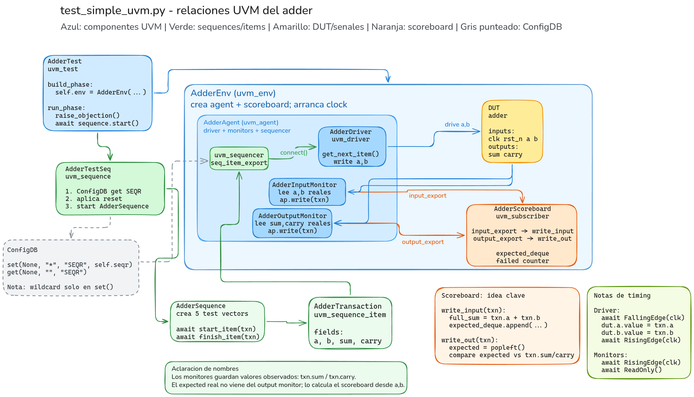

# MODULE 3: UVM Fundamentals

<!--toc:start-->
- [MODULE 3: UVM Fundamentals](#module-3-uvm-fundamentals)
  - [Jerarquia UVM](#jerarquia-uvm)
  - [Class Hierarchy example code](#class-hierarchy-example-code)
    - [Cambios realizados (Class Hierarchy)](#cambios-realizados-class-hierarchy)
      - [Error 1](#error-1)
      - [Error 2](#error-2)
      - [Error 3](#error-3)
  - [UVM Phases](#uvm-phases)
  - [Reporting](#reporting)
    - [Para configurar el verbosity level en pyuvm:](#para-configurar-el-verbosity-level-en-pyuvm)
  - [Configuration Database](#configuration-database)
  - [Factory](#factory)
  - [Objection Mechanism](#objection-mechanism)
  - [Test UVM Adder](#test-uvm-adder)
    - [Test UVM Adder example code (`test_simple_uvm.py`)](#test-uvm-adder-example-code-testsimpleuvmpy)
    - [Cambios recientes en `test_simple_uvm.py`](#cambios-recientes-en-testsimpleuvmpy)
    - [Por qué dos monitores (input y output)](#por-qué-dos-monitores-input-y-output)
    - [Detalles de sincronización](#detalles-de-sincronización)
<!--toc:end-->

Focusing on UVM (Universal Verification Methodology) fundamentals including class hierarchy, phases, reporting, configuration database, factory pattern, and objection mechanism.

En esto módulo se profundiza en los siguientes temas:
- Class Hierarchy
- Phases
- Reporting
- Configuration Database
- Factory Pattern
- Objection Mechanism

## Jerarquia UVM

Clases base:
- uvm_object: Base para todos los objetos UVM
- uvm_component: Base para todos los componentes UVM

Componentes:
- uvm_test - Clase de test de nivel superior
- uvm_env - Contenedor de entornos
- uvm_agent - Agente (driver, monitor, sequencer)
- uvm_driver - Genera transacciones hacia el DUT
- uvm_monitor - Monitorea señales del DUT
- uvm_sequencer - Maneja secuencias
- uvm_scoreboard - Verifica resultados

Objetos:
- uvm_sequence_item - Objetos de transacción
- uvm_sequence - Secuencia de transacciones
- uvm_config_object - Objetos de configuración

> Debe quedar claro: `uvm_agent` - Agent (driver, monitor, sequencer)

Relaciones entre clases:
  - Inheritance hierarchy: `uvm_component` -> `uvm_agent` -> `uvm_driver`, `uvm_monitor`, `uvm_sequencer`
  - Composition patterns: `uvm_env` contiene agentes, `uvm_test` contiene ambientes, etc.
  - Factory pattern: `uvm_factory` para crear objetos de manera flexible y configurable.

A partir de aca voy a eliminar este wrapper que ya no es necesario:
```python
# Cocotb test function to run the pyuvm test
@cocotb.test()
async def test_class_hierarchy(dut):
    """Cocotb test wrapper for pyuvm test."""
    # Register the test class with uvm_root so run_test can find it
    if not hasattr(uvm_root(), 'm_uvm_test_classes'):
        uvm_root().m_uvm_test_classes = {}
    uvm_root().m_uvm_test_classes["ClassHierarchyTest"] = ClassHierarchyTest
    # Use uvm_root to run the test properly (executes all phases in hierarchy)
    await uvm_root().run_test("ClassHierarchyTest")
```

Esto se puede eliminar colocando el decorador `@pyuvm.test()` directamente en la clase de test, lo cual es más limpio y directo.

## Class Hierarchy example code

* Primero creamos un objeto de tipo transaction (`MyTransaction`), el cual tiene dos campos: `data` y `address`. Esta clase extiende de `uvm_sequence_item`, lo que la hace compatible con el mecanismo de secuencias y drivers de UVM.
* Luego, creamos un driver (`MyDriver`) que extiende de `uvm_driver`. En su `build_phase`, se crea un puerto de tipo `uvm_seq_item_port` (esto ya se hace por default, descrito en los errores de esta sección) para recibir transacciones. Hay una fase de `connect_phase` donde se podrían conectar puertos a otros componentes (como por ejemplo conectar el puerto del driver al puerto del sequencer), pero en este ejemplo no se hace nada específico. En el `run_phase`, el driver espera a recibir una transacción a través del puerto, y luego la procesa (en este caso, simplemente imprime sus campos).
* Luego, creamos un monitor (`MyMonitor`) que extiende de `uvm_monitor`. En su `build_phase` crea un `uvm_analysis_port` para enviar información a otros componentes (como por ejemplo a un scoreboard o un suscriber). En el `run_phase` simula la generación de transacciones (en este caso, simplemente crea una transacción con valores fijos y la imprime) y luego la envía a través del `analysis_port`.
* Lo siguiente es crear un agente (`MyAgent`) que extiende de `uvm_agent`. En su `build_phase` crea instancias del driver, el monitor y el sequencer. En este ejemplo se conecta el puerto del driver al puerto del sequencer, pero no se hace nada con el monitor.
* Luego, se crea un ambiente (`MyEnv`) que extiende de `uvm_env`. En su `build_phase` crea una instancia del agente. En su `connect_phase` se podrían conectar los puertos del agente a otros componentes del ambiente, pero en este ejemplo no se hace nada específico.
* Finalmente, se crea una clase de test (`ClassHierarchyTest`) que extiende de `uvm_test`. En su `build_phase` crea una instancia del ambiente. En su `connect_phase` se podrían conectar los puertos del ambiente a otros componentes del test, pero en este ejemplo no se hace nada específico. Solo crear un transaction. 

> Este ejemplo es muy básico y no hace nada funcional, pero sirve para ilustrar la estructura de clases y fases en UVM.

### Cambios realizados (Class Hierarchy)

#### Error 1
- **Error:** `RuntimeWarning: coroutine 'ClassHierarchyTest.build_phase/connect_phase' was never awaited`
- **Por que sucede:** En pyuvm, `build_phase` y `connect_phase` se ejecutan de forma sincronica (sin `await`). Si se definen como `async def`, al invocarlas como metodos normales se crea una corrutina que no se espera, y Python lanza ese warning.
- **Como se arreglo:** Cambiar esas fases en `ClassHierarchyTest` de `async def` a `def`.

#### Error 2
- **Error:** `NameError: name 'uvm_seq_item_pull_port' is not defined`
- **Por que sucede:** En esta version de pyuvm no existe `uvm_seq_item_pull_port`; la API valida es `uvm_seq_item_port`.
- **Como se arreglo:** Se reemplazo por `uvm_seq_item_port`.

#### Error 3
- **Error:** `already has a child named seq_item_port`
- **Por que sucede:** `uvm_driver` ya trae `seq_item_port` por defecto. Al crearlo otra vez en `build_phase`, se duplica el hijo con el mismo nombre.
- **Como se arreglo:** Se elimino la creacion manual de `seq_item_port` en el driver.


## UVM Phases

En `phases_example.py` se demuestra el orden de fases con un componente (`PhasesComponent`), un env (`PhasesEnv`) y un test (`PhasesTest`).

- `build_phase`: crea la jerarquia (`test -> env -> comp`) e inicializa variables.
- `connect_phase`: conecta componentes (en este ejemplo, solo loguea).
- `end_of_elaboration_phase`: cierra la construccion antes de correr la simulacion.
- `run_phase` (en el test): levanta objection, espera `200ns` y luego baja objection para terminar.
- `extract/check/report/final`: se ejecutan al final para extraer, verificar y reportar resultados.

Resultado observado al correr `uv run make` en `module3/examples/phases`:
- El test pasa (`PASS=1, FAIL=0`).
- En el log se ven `build`, `connect`, `end_of_elaboration`, `run`, `extract`, `check`, `report` y `final`.
- Las subfases declaradas en el componente (`pre_reset/reset/post_reset`, `pre_main/main/post_main`, `pre_shutdown/shutdown/post_shutdown`) no aparecen ejecutadas en este ejemplo.

```bash
     0.00ns INFO     ..es/phases/phases_example.py(131) [uvm_test_top]: ============================================================
     0.00ns INFO     ..es/phases/phases_example.py(132) [uvm_test_top]: PHASES TEST - Build Phase
     0.00ns INFO     ..es/phases/phases_example.py(133) [uvm_test_top]: ============================================================
     0.00ns INFO     ..es/phases/phases_example.py(111) [uvm_test_top.env]: [BUILD] Building PhasesEnv
     0.00ns INFO     ..les/phases/phases_example.py(19) [uvm_test_top.env.comp]: [BUILD] comp: Building component
     0.00ns INFO     ..les/phases/phases_example.py(24) [uvm_test_top.env.comp]: [CONNECT] comp: Connecting component
     0.00ns INFO     ..es/phases/phases_example.py(115) [uvm_test_top.env]: [CONNECT] Connecting PhasesEnv
     0.00ns INFO     ..es/phases/phases_example.py(138) [uvm_test_top]: PHASES TEST - Connect Phase
     0.00ns INFO     ..es/phases/phases_example.py(118) [uvm_test_top.env]: [END_OF_ELAB] PhasesEnv elaboration complete
     0.00ns INFO     ..les/phases/phases_example.py(28) [uvm_test_top.env.comp]: [END_OF_ELAB] comp: Elaboration complete
     0.00ns INFO     ..es/phases/phases_example.py(143) [uvm_test_top]: PHASES TEST - Run Phase (all run phases execute here)
   200.00ns INFO     ..les/phases/phases_example.py(92) [uvm_test_top.env.comp]: [EXTRACT] comp: Extracting results
   200.00ns INFO     ..es/phases/phases_example.py(149) [uvm_test_top]: PHASES TEST - Check Phase
   200.00ns INFO     ..les/phases/phases_example.py(96) [uvm_test_top.env.comp]: [CHECK] comp: Checking results
   200.00ns INFO     ..es/phases/phases_example.py(153) [uvm_test_top]: ============================================================
   200.00ns INFO     ..es/phases/phases_example.py(154) [uvm_test_top]: PHASES TEST - Report Phase
   200.00ns INFO     ..es/phases/phases_example.py(155) [uvm_test_top]: ============================================================
   200.00ns INFO     ..es/phases/phases_example.py(100) [uvm_test_top.env.comp]: [REPORT] comp: Generating report
   200.00ns INFO     ..es/phases/phases_example.py(104) [uvm_test_top.env.comp]: [FINAL] comp: Final cleanup
```

## Reporting

En `reporting_example.py` se muestra el uso del sistema de reporting de UVM con diferentes niveles de severidad (INFO, WARNING, ERROR, FATAL) y cómo controlar la verbosidad.

- En `ReportingTest`, se muestra el uso de `self.logger` para generar mensajes con diferentes severidades. Se pueden controlar los mensajes que se muestran ajustando el nivel de reporte (por ejemplo, `uvm_report_level`) o la verbosidad.
- En `HierarchicalReportingTest`, se muestra cómo un componente (`ReportingComponent`) puede generar reportes que se propagan a través de la jerarquía. El componente tiene su propio logger, y al generar un mensaje, este se muestra con el nombre completo del componente (por ejemplo, `[uvm_test_top.comp] Component reporting`), lo que ayuda a identificar de dónde viene el mensaje.

### Para configurar el verbosity level en pyuvm:

1. **Global para todo el test:**  
   Llama a `uvm_report_object.set_default_logging_level(logging_level)` al inicio (por ejemplo, en `build_phase` del test).  
   Ejemplo:  
   ```python
   import logging
   uvm_report_object.set_default_logging_level(logging.DEBUG)
   ```
2. **Solo para un componente:**  
   Usa `self.set_logging_level(logging_level)` dentro del componente.

3. **Jerárquico (componente y todos sus hijos):**  
   Usa `self.set_logging_level_hier(logging_level)` en el componente raíz.

Los niveles válidos son los de Python logging: `logging.INFO`, `logging.DEBUG`, etc.

No se configura con UVM_LOW/UVM_HIGH, sino con los niveles estándar de logging de Python.

## Configuration Database

En `configdb_example.py` se muestra cómo usar la Configuration Database (ConfigDB) de UVM para almacenar y recuperar configuraciones de manera jerárquica.

```Python
# Configuramos para el path del agente
ConfigDB().set(self, "agent", "agent_config", agent_config)
```

En estos ejemplos se ha creado la siguiente estructura:

```Markdown
    Tests
      |
      |
      V
ConfigurableEnv
      |
      |
      V
ConfigurableAgent <-- AgentConfig
```

## Factory

Todas las clases se registran automáticamente, por ende se puede emplear
- `create()`
- `uvm_factory().set_type_override_by_type()`

## Objection Mechanism

Las objeciones se usan para controlar la duración de las fases, especialmente `run_phase`. Un componente puede levantar una objeción para indicar que aún no ha terminado su trabajo, y luego bajarla cuando termine. El test no finalizará hasta que todas las objeciones estén bajadas.

- `raise_objection()`: Levanta una objeción, incrementando el contador de objeciones.
- `drop_objection()`: Baja una objeción, decrementando el contador. Si el contador llega a cero, se permite avanzar a la siguiente fase o finalizar el test.

Nota: En pyuvm, el mecanismo de objeciones se maneja automáticamente al usar `await uvm_root().run_test()`, por lo que no es necesario implementar un loop de espera manual para las objeciones. El framework se encarga de esperar a que todas las objeciones estén bajadas antes de finalizar el test.

## Test UVM Adder

Siempre:

Test → Env → Agent → Driver/Monitor/Sequencer

Tener claro Secuencias y Secuencias Items:
- `uvm_sequence_item`: Es la clase base para las transacciones. Define los campos que se van a enviar al DUT (por ejemplo, `data`, `address`, etc.).
- `uvm_sequence`: Es la clase base para las secuencias. Define el comportamiento de generación de transacciones, como por ejemplo qué valores asignar a los campos de las transacciones, cuándo generarlas, etc.

> En pyuvm, tanto los puertos comunes como los de "pull" se unificaron bajo una única clase base: uvm_seq_item_port.

### Test UVM Adder example code (`test_simple_uvm.py`)

DUT: `module3/dut/simple_blocks/adder.v` (o `.vhd`), un sumador combinacional de 8 bits con acarreo, sincronizado a un reloj (`clk`) y con reset activo bajo (`rst_n`).

Vista general del testbench UVM implementado en `test_simple_uvm.py`:



Jerarquía construida en `build_phase`:

```
AdderTest
  └─ env (AdderEnv)
       ├─ agent (AdderAgent)
       │    ├─ driver    (AdderDriver)
       │    ├─ in_monitor  (AdderInputMonitor)
       │    ├─ out_monitor (AdderOutputMonitor)
       │    └─ seqr      (uvm_sequencer)
       └─ scoreboard (AdderScoreboard, uvm_subscriber)
```

Componentes:

- **`AdderTransaction`** (`uvm_sequence_item`): guarda `a`, `b`, `sum`, `carry`. La misma clase de transacción se reutiliza tanto para lo que la secuencia pide como para lo que cada monitor observa.
- **`AdderSequence`** (`uvm_sequence`): genera 5 vectores de prueba fijos (incluye 2 casos de overflow) y los envía uno a uno con `start_item`/`finish_item`.
- **`AdderDriver`** (`uvm_driver`): el único componente que escribe en el DUT. En `run_phase` hace `get_next_item()`, espera `FallingEdge(clk)` para evitar carreras con el DUT, escribe `a`/`b`, espera `RisingEdge(clk)` y llama `item_done()`.
- **`AdderInputMonitor`** / **`AdderOutputMonitor`** (`uvm_monitor`): **pasivos**, no escriben nada. Cada uno espera `RisingEdge(clk)` + `ReadOnly()` (para leer el valor ya asentado al final del delta-cycle), valida que la señal no sea `X`/`Z` (`is_resolvable`) y publica una `AdderTransaction` por su `uvm_analysis_port`. El input_monitor lee `a`/`b` (lo que realmente llegó al DUT); el output_monitor lee `sum`/`carry`.
- **`AdderScoreboard`** (`uvm_subscriber`): tiene dos `uvm_analysis_export` (`input_export`, `output_export`), cada uno con su `write` redirigido a un método distinto:
  - `write_input`: al llegar una transacción de entrada, calcula de inmediato `a + b` y guarda el resultado esperado en un `deque` (predictor).
  - `write_out`: al llegar la transaccion de salida, saca lo esperado del `deque` y lo compara contra `sum`/`carry` observados en el DUT.
- **`AdderAgent`** (`uvm_agent`): crea driver, ambos monitores y el sequencer; guarda el sequencer en `ConfigDB` con la clave `SEQR`; en `connect_phase` conecta `driver.seq_item_port` con `seqr.seq_item_export`.
- **`AdderEnv`** (`uvm_env`): crea agente y scoreboard; en `connect_phase` conecta `in_monitor.ap` → `scoreboard.input_export` y `out_monitor.ap` → `scoreboard.output_export`; en `start_of_simulation_phase` arranca el clock del DUT.
- **`AdderTestSeq`** (`uvm_sequence`): funciona como una secuencia principal del test. Recupera el sequencer desde `ConfigDB`, aplica reset al DUT, ejecuta `AdderSequence` y deja un margen final de `10ns`.
- **`AdderTest`** (`uvm_test`): en `end_of_elaboration_phase` crea `AdderTestSeq`; en `run_phase` solo levanta objection, arranca la secuencia principal y baja objection. En `check_phase`/`report_phase` solo loguea.

### Cambios recientes en `test_simple_uvm.py`

- Se movio la generacion del clock desde `AdderTest.run_phase()` hacia `AdderEnv.start_of_simulation_phase()`. Esto separa mejor la infraestructura del testbench del estimulo concreto del test.
- Se agrego `AdderTestSeq` como secuencia de nivel superior. Esta secuencia aplica reset, obtiene el sequencer y luego arranca `AdderSequence`.
- Se empezo a usar `ConfigDB` para compartir el sequencer: `AdderAgent` hace `ConfigDB().set(None, "*", "SEQR", self.seqr)` y `AdderTestSeq` lo recupera con `ConfigDB().get(None, "", "SEQR")`.
- Punto importante de `ConfigDB` en pyuvm: el wildcard `"*"` se puede usar al guardar con `set()`, pero no al leer con `get()`. Por eso `get(None, "*", "SEQR")` falla con `"inst_name wildcards only allowed when storing"`.
- Se renombraron los campos de salida observada de `expected_sum`/`expected_carry` a `sum`/`carry`. El output monitor no produce valores esperados; produce valores reales observados del DUT. Los valores esperados los calcula el scoreboard desde la transaccion capturada por el input monitor.
- Se corrigio el typo `unitss="ns"` por `units="ns"` al usar `Clock`/`Timer`.

### Por qué dos monitores (input y output)

El scoreboard nunca confía en lo que la secuencia *pidió*, sino en lo que cada monitor **observó realmente en el pin** del DUT:

- El `AdderInputMonitor` captura `a`/`b` tal como llegaron al DUT (después del timing real del driver), no los valores que generó la secuencia.
- Esto permite que el predictor (`write_input`) calcule el resultado esperado a partir de evidencia real del bus, no de la intención del testbench.
- Si el scoreboard reporta un fallo, se puede descartar el driver/timing como causa: si el input_monitor capturó los valores correctos y aun así el output no coincide, el error está en el DUT.

Ambos monitores son simétricos en diseño (mismo patrón `RisingEdge` + `ReadOnly` + assert de resolubilidad + `ap.write`), solo cambia qué señales leen. Ninguno maneja timing ni conduce señales — esa responsabilidad es exclusiva del driver.

### Detalles de sincronización

- `ReadOnly()` asegura que el monitor lea el valor ya estable al final del delta-cycle del `RisingEdge`, evitando leer un valor transitorio.
- `is_resolvable` valida que la señal no tenga bits en `X`/`Z` antes de convertirla a entero; si el DUT aún no se ha estabilizado (por ejemplo, justo después del reset), esto lanza un assert claro en vez de un error críptico de conversión.
- El driver escribe en `FallingEdge` para dejar el valor asentado antes del siguiente `RisingEdge`, evitando condiciones de carrera con la lógica síncrona del DUT.

> **Nota al pie — fragilidad del `expected_deque` en el scoreboard:** el scoreboard actual empareja entrada/salida solo por **orden de llegada** (`deque.append` en `write_input`, `deque.popleft` en `write_out`). Esto asume que ambos monitores producen exactamente un evento por transacción real, en el mismo orden, sin duplicados ni huecos. Esa suposición se rompe fácilmente: ambos monitores muestrean en *cada* `RisingEdge(clk)` sin verificar si hubo un item nuevo, así que un ciclo idle entre dos `get_next_item()` del driver (o durante el reset inicial) puede meter una entrada espuria en la cola. A partir de ahí todo se desalinea en cascada, y el scoreboard reporta fallos que en realidad son bugs del testbench, no del DUT.
>
> **Solución general (correlación por identidad, no por orden):** cuando el protocolo no trae un tag/ID propio (como este adder, a diferencia de, por ejemplo, un ID de transacción en AXI), la marca debe generarse en el testbench y adjuntarse a la transacción en el momento de captura. Como ambos monitores muestrean sobre el mismo reloj (`await RisingEdge(self.dut.clk)`), el instante de muestreo (`cocotb.utils.get_sim_time()` o un contador de flancos) sirve como etiqueta compartida por construcción, sin que cada monitor necesite llevar su propio contador. En la práctica: agregar un campo `cycle_id` a `AdderTransaction`, asignarlo en ambos monitores justo después del `ReadOnly()`, y reemplazar el `deque` del scoreboard por un `dict` keyed por `cycle_id` (`expected_by_cycle[txn.cycle_id] = ...` en `write_input`, `expected_by_cycle.pop(txn.cycle_id, None)` en `write_out`). Así el emparejamiento depende de la identidad del evento, no del orden de llegada, y una clave faltante señala el ciclo exacto del problema en vez de desplazar silenciosamente todas las comparaciones siguientes.
