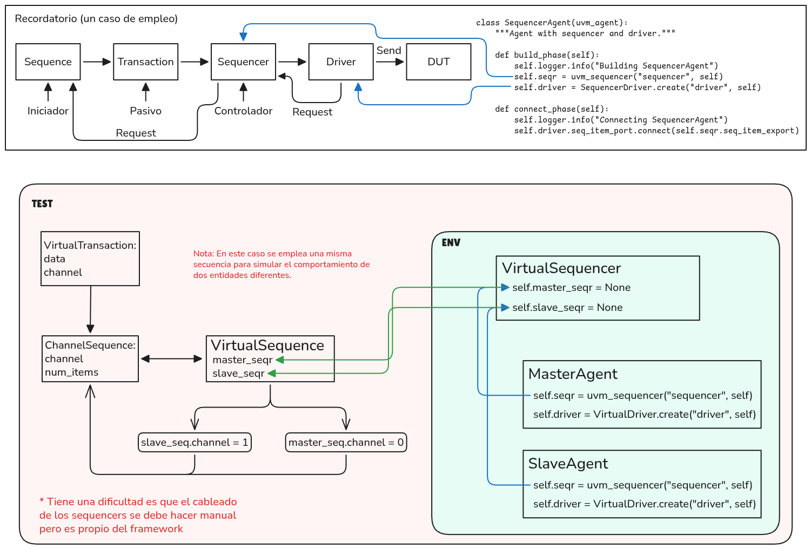

# Module 5: Conceptos Avanzados de UVM

## Secuencias Virtuales

### Idea central
Una **secuencia virtual** no genera transacciones propias. Es una capa de **orquestación** que coordina secuencias reales corriendo en múltiples secuenciadores distintos (útil cuando el DUT tiene varias interfaces que deben estimularse de forma coordinada).

### Componentes

| Componente | Rol |
|---|---|
| **VirtualSequencer** | Extiende `uvm_sequencer`. Solo contiene referencias a otros sequencers (`master_seqr`, `slave_seqr`), inicializadas en `None` en `build_phase()`. **No tiene `connect_phase`** — no le corresponde a él llenarlas. |
| **VirtualSequence** | Extiende `uvm_sequence`. Obtiene las referencias a los sequencers reales a través de `self.sequencer` (el sequencer sobre el que fue arrancada), no de atributos seteados a mano |
| **ChannelSequence** | Secuencia "normal" que genera transacciones para un canal específico. Se reutiliza para simular distintos roles (master/slave) cambiando el atributo `channel` |

### El cambio clave: `self.sequencer` en vez de cableado manual

**Antes (con bug):** el `VirtualSequencer` intentaba resolver sus propias referencias:
```python
# ❌ Roto: el sequencer no tiene acceso a self.env
def connect_phase(self):
    self.master_seqr = self.env.master_agent.seqr
```
Esto lanzaba `AttributeError` porque un `uvm_sequencer` no tiene noción de `env`.

**Ahora:** el `VirtualSequencer` solo declara y expone los slots:
```python
class VirtualSequencer(uvm_sequencer):
    def build_phase(self):
        self.master_seqr = None
        self.slave_seqr = None
```

Es el **env** —que sí conoce a todos los agentes— quien llena las referencias:
```python
class VirtualEnv(uvm_env):
    def connect_phase(self):
        self.virtual_seqr.master_seqr = self.master_agent.seqr
        self.virtual_seqr.slave_seqr = self.slave_agent.seqr
```

Y la `VirtualSequence` ya no recibe nada por atributos externos. Cuando se arranca sobre el virtual sequencer (`await virtual_seq.start(self.env.virtual_seqr)`), pyuvm setea `self.sequencer = virtual_seqr` automáticamente. Entonces el `body()` simplemente lee:
```python
async def body(self):
    master_seqr = self.sequencer.master_seqr
    slave_seqr = self.sequencer.slave_seqr
```

Esto es el equivalente pyuvm de `p_sequencer` en SystemVerilog/UVM: la secuencia obtiene el sequencer "tipado" sobre el que corre, sin que nadie tenga que pasarle nada a mano desde afuera.

### Patrones de ejecución 

**Paralelo:**
```python
master_task = cocotb.start_soon(master_seq.start(master_seqr))
slave_task = cocotb.start_soon(slave_seq.start(slave_seqr))
await master_task
await slave_task
```

**Secuencial:**
```python
await seq1.start(master_seqr)
await seq2.start(slave_seqr)
```

### Test — arranque simplificado
```python
virtual_seq = VirtualSequence(name="virtual_seq")
await virtual_seq.start(self.env.virtual_seqr)
```
Sin copiar referencias a mano antes de arrancar. El único cableado manual que queda es el del **env**, que es donde corresponde (es el único componente que conoce a todos los agentes).

### Flujo resultante
```
VirtualEnv.connect_phase        →  llena virtual_seqr.master_seqr / .slave_seqr
        │
virtual_seq.start(virtual_seqr) →  self.sequencer = virtual_seqr
        │
VirtualSequence.body()          →  lee self.sequencer.master_seqr / .slave_seqr
```




### Qué se corrigió respecto a la primera versión
- ❌ `AttributeError` por acceder a `self.env` desde el sequencer → ✅ eliminado.
- ❌ Cableado manual duplicado en el test → ✅ eliminado, el test solo arranca la secuencia.
- ✅ El `VirtualSequencer` ahora cumple su función real: único punto de referencias, consultado vía `self.sequencer` — el patrón correcto de `p_sequencer` en pyuvm.


## Functional Coverage

### ¿Para qué sirve esto en verificación?

En verificación, correr tests no alcanza: hay que poder responder **"¿qué tanto del comportamiento del DUT ya ejercitamos?"**. Hay dos formas de medir eso:

- **Code coverage** (líneas, branches, toggles del RTL): mide si el *código del DUT* se ejecutó, pero no dice nada sobre si los *casos que importan al diseño* se probaron. Un test puede tocar el 100% de las líneas y aun así nunca haber probado, por ejemplo, un comando inválido en una dirección límite.
- **Functional coverage** (lo que se implementa acá): mide si se ejercitaron los **escenarios que el verificador definió como relevantes**, en términos del protocolo/spec, no del código. Es una métrica que el ingeniero de verificación diseña a mano, a partir del plan de verificación (qué combinaciones de datos, direcciones, comandos, etc. *deberían* probarse).

Por eso cada bloque de este ejemplo modela una pregunta distinta que un plan de verificación real haría:

- **Data coverage** (`data_coverage`): "¿probamos suficiente variedad de valores de dato, o el generador random siempre cae en los mismos pocos valores?". Sirve para detectar generadores de estímulo sesgados.
- **Address range coverage** (`address_ranges`): "¿tocamos las tres regiones de memoria (low/mid/high), o el test solo golpea una zona?". Es el equivalente a comprobar que se probaron los *casos límite estructurales* del mapa de memoria (por ejemplo, el borde entre `mid` y `high`).
- **Command coverage** (`command_coverage`): "¿se ejecutaron todos los comandos soportados por el protocolo (read, write, reset, etc.), o el test nunca llega a probar alguno?". Sin esto, es fácil tener un DUT con un comando roto que ningún test detecta porque simplemente nunca se envió.
- **Cross coverage** (`cross_coverage`): la pregunta más importante y la que un ingeniero nuevo suele subestimar: "¿probamos las *combinaciones* de dato y comando, no solo cada uno por separado?". Un bug típico de hardware aparece solo cuando un comando específico se ejecuta con un dato específico (p. ej. un overflow que solo ocurre con `data=0xFF` y `command=WRITE`). Cubrir data y command por separado al 100% no garantiza que se haya probado esa combinación puntual — para eso existe el cross.

La idea de fondo (heredada de SystemVerilog/UVM, donde esto se declara con `covergroup`/`coverpoint`/`bins`/`cross`) es **coverage-driven verification**: el plan de verificación define qué combinaciones importan, el coverage model mide cuáles ya se dispararon, y el porcentaje de cobertura le dice al equipo cuándo el testing ya cubrió lo que se consideró necesario — a diferencia de "correr tests hasta que se acabe el tiempo".

### Idea central
El **coverage model** (`CoverageModel`) es un `uvm_subscriber`: un componente que se "suscribe" a transacciones publicadas por un analysis port y las usa para acumular estadísticas de cobertura, sin generar ni transformar tráfico. En este ejemplo el objetivo era mostrar la mecánica del muestreo (coverpoints, bins, cross coverage, reporte) de forma aislada, así que el `CoverageMonitor` **genera las transacciones directamente** en su `run_phase()` en vez de observarlas viniendo de un Driver → DUT real. Es un atajo válido para enseñar el patrón de coverage sin montar todo el entorno (agent, driver, DUT); en un testbench real el monitor observaría la interfaz del DUT y publicaría lo que realmente pasó por el pin.

### Componentes

| Componente | Rol |
|---|---|
| **CoverageTransaction** | `uvm_sequence_item` simple: `data`, `address`, `command`. Es el objeto que se muestrea. |
| **CoverageModel** | Extiende `uvm_subscriber`. No necesita crear su propio `analysis_export` — `uvm_subscriber` ya lo provee. Implementa `write(txn)`, que es el callback invocado cada vez que llega una transacción por el analysis port. |
| **CoverageMonitor** | Extiende `uvm_monitor`. Crea un `uvm_analysis_port` y, en este ejemplo, genera vectores de prueba fijos y los publica con `self.ap.write(txn)` en vez de derivarlos de actividad real del DUT. |
| **CoverageEnv** | Cablea `monitor.ap` → `coverage.analysis_export` en `connect_phase()`. Este cableado es el mismo que se usaría con un monitor real. |

### Qué se muestrea en `write()`
- **Data coverage**: diccionario `valor → cantidad de veces visto`. El tamaño del dict (`len(...)`) es la cantidad de valores únicos cubiertos.
- **Address range coverage**: bins manuales por rango (`low` < 0x4000, `mid` < 0x8000, `high` resto) — equivalente a un coverpoint con bins explícitos en SystemVerilog.
- **Command coverage**: mismo patrón que data coverage, por comando.
- **Cross coverage**: dict con clave `(data, command)` — equivalente a un `cross` de dos coverpoints en SV.

### Flujo de datos
```
CoverageMonitor.run_phase()   →  genera txn (test_vectors fijos) y hace self.ap.write(txn)
        │
CoverageEnv.connect_phase()   →  monitor.ap.connect(coverage.analysis_export)
        │
CoverageModel.write(txn)      →  acumula en data_coverage / address_ranges / command_coverage / cross_coverage
        │
CoverageModel.report_phase()  →  imprime porcentajes (coverage['data_coverage'] / max_data, etc.)
```

### Cómo reusar este patrón en tests reales
- Reemplazar la generación fija de `test_vectors` en `CoverageMonitor.run_phase()` por la lógica real de observación (leer señales del DUT vía `dut.<signal>.value`, o recibir la transacción ya armada desde un monitor pasivo conectado al bus).
- El resto del componente (`CoverageModel`, el cableado `ap.connect(analysis_export)`, el patrón `write()` + `report_phase()`) se reutiliza sin cambios: es agnóstico a si la transacción vino de un DUT real o de datos sintéticos.
- Para reusar en otro test/agent: el mismo `CoverageModel` puede conectarse a **más de un** analysis port (por ejemplo el monitor de un driver y el de un scoreboard) si se necesita cobertura combinada — basta con múltiples `connect()` hacia el mismo `analysis_export`.
- Los bins manuales (`if/elif` para rangos, dicts para valores únicos) son la forma "manual" de hacer covergroups en pyuvm, ya que pyuvm no tiene macros de coverage nativas como SV (`covergroup`/`coverpoint`/`bins`). Si el proyecto crece, vale la pena extraer un helper genérico de bins (rango, enumeración, cruce) para no repetir este boilerplate en cada modelo de coverage nuevo.
- Registrar el `CoverageTest` con `@pyuvm.test()` (en vez del wrapper manual de `@cocotb.test()` + `uvm_root().run_test(...)`) es el patrón estándar en pyuvm reciente para que el test sea descubierto automáticamente.

### Guía: construir helpers genéricos de coverage (sin macros de SV)

SystemVerilog resuelve esto con `covergroup` / `coverpoint` / `bins` en el lenguaje. En Python no existe ese azúcar sintáctico, pero el mismo concepto se modela con **diccionarios como tabla de bins** más una clase fina que sabe "en qué bin cae un valor". La idea es separar dos cosas que en el ejemplo estaban mezcladas a mano: *la definición de los bins* y *el conteo de hits*.

**1. Un `Coverpoint` genérico con bins por función**

Cada bin es simplemente un nombre + un predicado (`value -> bool`). El coverpoint prueba el valor contra cada predicado y suma el hit al primero que matchee:

```python
class Coverpoint:
    """Coverpoint genérico: nombre + lista de bins (nombre, predicado)."""

    def __init__(self, name, bins):
        self.name = name
        self.bins = bins  # lista de (bin_name, predicate)
        self.hits = {bin_name: 0 for bin_name, _ in bins}

    def sample(self, value):
        for bin_name, predicate in self.bins:
            if predicate(value):
                self.hits[bin_name] += 1
                return bin_name
        return None  # valor fuera de todos los bins definidos

    def coverage_percent(self):
        hit_bins = sum(1 for count in self.hits.values() if count > 0)
        return (hit_bins / len(self.bins)) * 100 if self.bins else 0.0
```

Esto reemplaza tanto el `if/elif` de `address_ranges` como los dicts de `data_coverage` / `command_coverage` del ejemplo actual:

```python
# Bins por rango (equivalente a los if/elif de address_ranges)
address_cp = Coverpoint("address", bins=[
    ("low",  lambda a: a < 0x4000),
    ("mid",  lambda a: 0x4000 <= a < 0x8000),
    ("high", lambda a: a >= 0x8000),
])

# Bins por valor único (equivalente al dict de data_coverage)
data_cp = Coverpoint("data", bins=[(f"val_{v}", (lambda v=v: lambda x: x == v)()) for v in range(256)])
```
Para bins "un valor = un bin" como `data_cp`, en la práctica conviene una variante más liviana que no enumere 256 lambdas (ver punto 3).

**2. Un `CrossCoverpoint` genérico**

El cross de dos coverpoints es, igual que en el ejemplo, un dict con clave tupla — solo que ahora se arma a partir de los bins ya resueltos, no de los valores crudos:

```python
class CrossCoverpoint:
    """Cross de dos (o más) coverpoints ya definidos."""

    def __init__(self, name, coverpoints):
        self.name = name
        self.coverpoints = coverpoints
        self.hits = {}

    def sample(self, values):
        bin_names = tuple(
            cp.sample(v) for cp, v in zip(self.coverpoints, values)
        )
        self.hits[bin_names] = self.hits.get(bin_names, 0) + 1
        return bin_names

    def coverage_percent(self):
        total_bins = 1
        for cp in self.coverpoints:
            total_bins *= len(cp.bins)
        return (len(self.hits) / total_bins) * 100 if total_bins else 0.0
```

**3. Bins "por valor único" sin enumerar a mano**

Para coverpoints tipo `data_coverage` (cualquier valor visto cuenta como su propio bin), no tiene sentido predefinir un bin por cada uno de los 256 valores posibles. Conviene una variante que crea bins on-the-fly:

```python
class ValueCoverpoint:
    """Coverpoint donde cada valor distinto observado es su propio bin."""

    def __init__(self, name, max_values):
        self.name = name
        self.max_values = max_values
        self.hits = {}

    def sample(self, value):
        self.hits[value] = self.hits.get(value, 0) + 1

    def coverage_percent(self):
        return (len(self.hits) / self.max_values) * 100 if self.max_values else 0.0
```

**4. Un `CoverageModel` que agrupa varios coverpoints**

Con estas piezas, el `write()` del `uvm_subscriber` queda declarativo en vez de tener la lógica de conteo repetida:

```python
class CoverageModel(uvm_subscriber):
    def build_phase(self):
        self.address_cp = Coverpoint("address", bins=[...])
        self.command_cp = ValueCoverpoint("command", max_values=256)
        self.data_cp = ValueCoverpoint("data", max_values=256)
        self.cross_cp = CrossCoverpoint("data_x_command", [self.data_cp, self.command_cp])

    def write(self, txn):
        self.address_cp.sample(txn.address)
        self.data_cp.sample(txn.data)
        self.command_cp.sample(txn.command)
        self.cross_cp.sample((txn.data, txn.command))

    def report_phase(self):
        for cp in (self.address_cp, self.command_cp, self.data_cp, self.cross_cp):
            self.logger.info(f"{cp.name}: {cp.coverage_percent():.1f}%")
```

**Cuándo vale la pena hacer este refactor**: mientras solo hay un modelo de coverage con 3-4 coverpoints (como en este ejemplo), el `if/elif` + dicts a mano es perfectamente legible y no amerita la abstracción. El helper genérico empieza a pagar su complejidad cuando aparece un **segundo o tercer** modelo de coverage en el proyecto (otro DUT, otro protocolo) que necesita el mismo tipo de bins — ahí `Coverpoint` / `ValueCoverpoint` / `CrossCoverpoint` evitan reescribir el mismo patrón de conteo cada vez.

### Caso de estudio: coverage-driven verification de un frecuencímetro

**El DUT**: mide la frecuencia de `clk_a` y `clk_b` (ambos más lentos que `ref_clk`) contando sus rising edges durante una ventana expresada en ciclos de `ref_clk`.

| Señal/registro | Rol |
|---|---|
| `start` | Dispara la medición. Se ignora si `busy=1`. |
| `busy` | 1 mientras la ventana está corriendo. |
| `reset` | Limpia el estado. Se ignora mientras `busy=1`. |
| `window` | Cantidad de ciclos de `ref_clk` que dura la medición. |
| `count_a`, `count_b` | Rising edges de `clk_a` / `clk_b` acumulados durante la ventana. Anchos lo bastante grandes como para no hacer overflow. |

El plan de verificación no busca "cubrir cada señal por separado" — busca las **combinaciones que un bug real explotaría**. Para este DUT, las preguntas relevantes son:

1. **¿Se probaron ventanas de distinto tamaño, incluyendo los bordes?** Una ventana muy chica (0 o 1 ciclo de `ref_clk`) es el caso límite más peligroso: como `clk_a`/`clk_b` son más lentos que `ref_clk`, es totalmente válido que el conteo dé **0** — el modelo de coverage debe confirmar que ese caso se ejercitó a propósito, no que simplemente nunca se probó.
2. **¿Se probó la relación entre el tamaño de la ventana y la velocidad de cada clock lento?** Si `window` es muy chico relativo al período de `clk_a`, puede no entrar ningún flanco (`count=0`); si es grande, entran varios. El bug típico de un contador de edges es un off-by-one en el borde exacto donde un flanco cae justo en el límite de la ventana — eso solo se descubre cruzando `window` contra la fase/período del clock lento, no probándolos por separado.
3. **¿Se probó `start` mientras `busy=1`?** El requisito dice que debe ignorarse. Si nadie manda un `start` durante `busy`, ese camino de "ignorar correctamente" nunca se ejercita y un bug ahí (que reinicie el conteo a mitad de ventana) pasaría inadvertido.
4. **¿Se probó `reset` mientras `busy=1`?** Mismo razonamiento que el punto 3, pero para `reset`.
5. **¿Se probaron `clk_a` y `clk_b` en la misma corrida, con relaciones de frecuencia distintas entre sí?** (uno bastante más lento que el otro, o casi iguales) — para descartar que el diseño tenga acoplamiento accidental entre los dos canales de conteo.

**Coverpoints usando los helpers de la sección anterior:**

```python
# Punto 1 y 2: tamaño de ventana, con foco en los bordes chicos
window_cp = Coverpoint("window", bins=[
    ("zero_or_one", lambda w: w <= 1),        # caso límite: ventana casi nula
    ("shorter_than_clk_period", lambda w: 1 < w < 8),  # puede no capturar ningún edge
    ("typical", lambda w: 8 <= w < 1024),
    ("max", lambda w: w >= 1024),
])

# Conteos observados por canal — cada valor de count es su propio bin,
# pero lo que importa verificar es que aparezca el caso "count == 0"
count_a_cp = Coverpoint("count_a", bins=[
    ("zero", lambda c: c == 0),
    ("nonzero", lambda c: c > 0),
])
count_b_cp = Coverpoint("count_b", bins=[
    ("zero", lambda c: c == 0),
    ("nonzero", lambda c: c > 0),
])

# Punto 3 y 4: control mientras busy=1 — el bin que realmente importa
# es "se intentó Y se ignoró", así que se muestrea junto con el estado de busy
control_cp = Coverpoint("control_while_busy", bins=[
    ("start_during_busy",  lambda ev: ev == "start" ),
    ("reset_during_busy",  lambda ev: ev == "reset" ),
    ("no_op_during_busy",  lambda ev: ev == "none"  ),
])

# Punto 1+2 combinado: cruzar tamaño de ventana con si el conteo resultó en 0 o no,
# para cada canal — esto es lo que expone el off-by-one en el borde de la ventana
window_x_count_a = CrossCoverpoint("window_x_count_a", [window_cp, count_a_cp])
window_x_count_b = CrossCoverpoint("window_x_count_b", [window_cp, count_b_cp])

# Punto 5: relación entre canales en la misma corrida
channel_ratio_cp = Coverpoint("channel_ratio", bins=[
    ("a_much_slower_than_b", lambda r: r < 0.5),
    ("similar_rate",         lambda r: 0.5 <= r <= 2.0),
    ("b_much_slower_than_a", lambda r: r > 2.0),
])
```

**Dónde se samplea cada uno** (en el `write()` del `CoverageModel`, alimentado por el monitor que observa el registro de control y los registros de conteo al final de cada ventana):

```python
def write(self, txn):
    # txn trae: window, count_a, count_b, control_event ("start"/"reset"/"none" mientras busy=1)
    self.window_cp.sample(txn.window)
    self.count_a_cp.sample(txn.count_a)
    self.count_b_cp.sample(txn.count_b)
    self.control_cp.sample(txn.control_event)
    self.window_x_count_a.sample((txn.window, txn.count_a))
    self.window_x_count_b.sample((txn.window, txn.count_b))
    if txn.count_a > 0:  # evita división por cero al calcular el ratio
        self.channel_ratio_cp.sample(txn.count_b / txn.count_a)
```

**Qué le dice este plan al equipo cuando llega a 100%:** que se probaron ventanas en el borde (incluida la que puede dar conteo 0), que el off-by-one en el límite ventana/edge fue ejercitado para ambos canales, que `start` y `reset` fueron enviados a propósito durante `busy` para confirmar que se ignoran, y que los dos canales lentos se corrieron con relaciones de frecuencia distintas entre sí — no solo que "se corrieron varios tests y no hubo error", que es la diferencia central entre coverage-driven verification y simplemente correr tests hasta cansarse.

## Object Configuration

Crear configuración compleja de forma centralizada y jerárquica, sin tener que pasar referencias a mano entre componentes. El patrón es:
- Un **objeto de configuración** (`ConfigObject`) que contiene todos los parámetros relevantes para un componente (por ejemplo, un agente).  
- Un **componente configurable** (`ConfigurableComponent`) que declara un atributo `config` y lo inicializa en `None`.  
- Un **env** que crea los objetos de configuración y los asigna a los componentes en `connect_phase()`.  
- Un **test** que crea el env y arranca la simulación, sin tener que pasar referencias a mano entre los componentes.    

