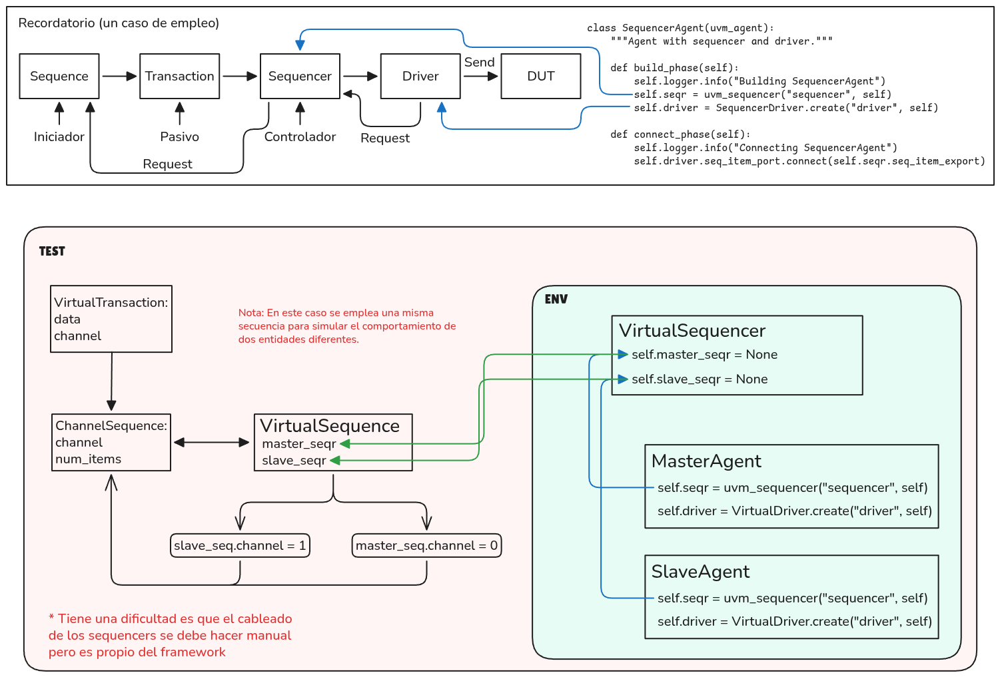

# Module 5: Conceptos Avanzados de UVM

## Secuencias Virtuales

### Idea central
Una **secuencia virtual** no genera transacciones propias. Es una capa de **orquestación** que coordina secuencias reales corriendo en múltiples secuenciadores distintos (útil cuando el DUT tiene varias interfaces que deben estimularse de forma coordinada).

### Componentes

| Componente | Rol |
|---|---|
| **VirtualSequencer** | Extiende `uvm_sequencer`. Solo contiene referencias a otros sequencers (`master_seqr`, `slave_seqr`), inicializadas en `None` en `build_phase()`. **No tiene `connect_phase`** — no le corresponde a él llenarlas. |
| **VirtualSequence** | Extiende `uvm_sequence`. Obtiene las referencias a los sequencers reales a través de `self.sequencer` (el sequencer sobre el que fue arrancada), no de atributos seteados a mano |
| **ChannelSequence** | Secuencia "normal" que genera transacciones para un canal específico. Se reutiliza para simular distintos roles (master/slave) cambiando el atributo `channel` |

### El cambio clave: `self.sequencer` en vez de cableado manual

**Antes (con bug):** el `VirtualSequencer` intentaba resolver sus propias referencias:
```python
# ❌ Roto: el sequencer no tiene acceso a self.env
def connect_phase(self):
    self.master_seqr = self.env.master_agent.seqr
```
Esto lanzaba `AttributeError` porque un `uvm_sequencer` no tiene noción de `env`.

**Ahora:** el `VirtualSequencer` solo declara y expone los slots:
```python
class VirtualSequencer(uvm_sequencer):
    def build_phase(self):
        self.master_seqr = None
        self.slave_seqr = None
```

Es el **env** —que sí conoce a todos los agentes— quien llena las referencias:
```python
class VirtualEnv(uvm_env):
    def connect_phase(self):
        self.virtual_seqr.master_seqr = self.master_agent.seqr
        self.virtual_seqr.slave_seqr = self.slave_agent.seqr
```

Y la `VirtualSequence` ya no recibe nada por atributos externos. Cuando se arranca sobre el virtual sequencer (`await virtual_seq.start(self.env.virtual_seqr)`), pyuvm setea `self.sequencer = virtual_seqr` automáticamente. Entonces el `body()` simplemente lee:
```python
async def body(self):
    master_seqr = self.sequencer.master_seqr
    slave_seqr = self.sequencer.slave_seqr
```

Esto es el equivalente pyuvm de `p_sequencer` en SystemVerilog/UVM: la secuencia obtiene el sequencer "tipado" sobre el que corre, sin que nadie tenga que pasarle nada a mano desde afuera.

### Patrones de ejecución 

**Paralelo:**
```python
master_task = cocotb.start_soon(master_seq.start(master_seqr))
slave_task = cocotb.start_soon(slave_seq.start(slave_seqr))
await master_task
await slave_task
```

**Secuencial:**
```python
await seq1.start(master_seqr)
await seq2.start(slave_seqr)
```

### Test — arranque simplificado
```python
virtual_seq = VirtualSequence(name="virtual_seq")
await virtual_seq.start(self.env.virtual_seqr)
```
Sin copiar referencias a mano antes de arrancar. El único cableado manual que queda es el del **env**, que es donde corresponde (es el único componente que conoce a todos los agentes).

### Flujo resultante
```
VirtualEnv.connect_phase        →  llena virtual_seqr.master_seqr / .slave_seqr
        │
virtual_seq.start(virtual_seqr) →  self.sequencer = virtual_seqr
        │
VirtualSequence.body()          →  lee self.sequencer.master_seqr / .slave_seqr
```




### Qué se corrigió respecto a la primera versión
- ❌ `AttributeError` por acceder a `self.env` desde el sequencer → ✅ eliminado.
- ❌ Cableado manual duplicado en el test → ✅ eliminado, el test solo arranca la secuencia.
- ✅ El `VirtualSequencer` ahora cumple su función real: único punto de referencias, consultado vía `self.sequencer` — el patrón correcto de `p_sequencer` en pyuvm.


## Functional Coverage

### ¿Para qué sirve esto en verificación?

En verificación, correr tests no alcanza: hay que poder responder **"¿qué tanto del comportamiento del DUT ya ejercitamos?"**. Hay dos formas de medir eso:

- **Code coverage** (líneas, branches, toggles del RTL): mide si el *código del DUT* se ejecutó, pero no dice nada sobre si los *casos que importan al diseño* se probaron. Un test puede tocar el 100% de las líneas y aun así nunca haber probado, por ejemplo, un comando inválido en una dirección límite.
- **Functional coverage** (lo que se implementa acá): mide si se ejercitaron los **escenarios que el verificador definió como relevantes**, en términos del protocolo/spec, no del código. Es una métrica que el ingeniero de verificación diseña a mano, a partir del plan de verificación (qué combinaciones de datos, direcciones, comandos, etc. *deberían* probarse).

Por eso cada bloque de este ejemplo modela una pregunta distinta que un plan de verificación real haría:

- **Data coverage** (`data_coverage`): "¿probamos suficiente variedad de valores de dato, o el generador random siempre cae en los mismos pocos valores?". Sirve para detectar generadores de estímulo sesgados.
- **Address range coverage** (`address_ranges`): "¿tocamos las tres regiones de memoria (low/mid/high), o el test solo golpea una zona?". Es el equivalente a comprobar que se probaron los *casos límite estructurales* del mapa de memoria (por ejemplo, el borde entre `mid` y `high`).
- **Command coverage** (`command_coverage`): "¿se ejecutaron todos los comandos soportados por el protocolo (read, write, reset, etc.), o el test nunca llega a probar alguno?". Sin esto, es fácil tener un DUT con un comando roto que ningún test detecta porque simplemente nunca se envió.
- **Cross coverage** (`cross_coverage`): la pregunta más importante y la que un ingeniero nuevo suele subestimar: "¿probamos las *combinaciones* de dato y comando, no solo cada uno por separado?". Un bug típico de hardware aparece solo cuando un comando específico se ejecuta con un dato específico (p. ej. un overflow que solo ocurre con `data=0xFF` y `command=WRITE`). Cubrir data y command por separado al 100% no garantiza que se haya probado esa combinación puntual — para eso existe el cross.

La idea de fondo (heredada de SystemVerilog/UVM, donde esto se declara con `covergroup`/`coverpoint`/`bins`/`cross`) es **coverage-driven verification**: el plan de verificación define qué combinaciones importan, el coverage model mide cuáles ya se dispararon, y el porcentaje de cobertura le dice al equipo cuándo el testing ya cubrió lo que se consideró necesario — a diferencia de "correr tests hasta que se acabe el tiempo".

### Idea central
El **coverage model** (`CoverageModel`) es un `uvm_subscriber`: un componente que se "suscribe" a transacciones publicadas por un analysis port y las usa para acumular estadísticas de cobertura, sin generar ni transformar tráfico. En este ejemplo el objetivo era mostrar la mecánica del muestreo (coverpoints, bins, cross coverage, reporte) de forma aislada, así que el `CoverageMonitor` **genera las transacciones directamente** en su `run_phase()` en vez de observarlas viniendo de un Driver → DUT real. Es un atajo válido para enseñar el patrón de coverage sin montar todo el entorno (agent, driver, DUT); en un testbench real el monitor observaría la interfaz del DUT y publicaría lo que realmente pasó por el pin.

### Componentes

| Componente | Rol |
|---|---|
| **CoverageTransaction** | `uvm_sequence_item` simple: `data`, `address`, `command`. Es el objeto que se muestrea. |
| **CoverageModel** | Extiende `uvm_subscriber`. No necesita crear su propio `analysis_export` — `uvm_subscriber` ya lo provee. Implementa `write(txn)`, que es el callback invocado cada vez que llega una transacción por el analysis port. |
| **CoverageMonitor** | Extiende `uvm_monitor`. Crea un `uvm_analysis_port` y, en este ejemplo, genera vectores de prueba fijos y los publica con `self.ap.write(txn)` en vez de derivarlos de actividad real del DUT. |
| **CoverageEnv** | Cablea `monitor.ap` → `coverage.analysis_export` en `connect_phase()`. Este cableado es el mismo que se usaría con un monitor real. |

### Qué se muestrea en `write()`
- **Data coverage**: diccionario `valor → cantidad de veces visto`. El tamaño del dict (`len(...)`) es la cantidad de valores únicos cubiertos.
- **Address range coverage**: bins manuales por rango (`low` < 0x4000, `mid` < 0x8000, `high` resto) — equivalente a un coverpoint con bins explícitos en SystemVerilog.
- **Command coverage**: mismo patrón que data coverage, por comando.
- **Cross coverage**: dict con clave `(data, command)` — equivalente a un `cross` de dos coverpoints en SV.

### Flujo de datos
```
CoverageMonitor.run_phase()   →  genera txn (test_vectors fijos) y hace self.ap.write(txn)
        │
CoverageEnv.connect_phase()   →  monitor.ap.connect(coverage.analysis_export)
        │
CoverageModel.write(txn)      →  acumula en data_coverage / address_ranges / command_coverage / cross_coverage
        │
CoverageModel.report_phase()  →  imprime porcentajes (coverage['data_coverage'] / max_data, etc.)
```

### Cómo reusar este patrón en tests reales
- Reemplazar la generación fija de `test_vectors` en `CoverageMonitor.run_phase()` por la lógica real de observación (leer señales del DUT vía `dut.<signal>.value`, o recibir la transacción ya armada desde un monitor pasivo conectado al bus).
- El resto del componente (`CoverageModel`, el cableado `ap.connect(analysis_export)`, el patrón `write()` + `report_phase()`) se reutiliza sin cambios: es agnóstico a si la transacción vino de un DUT real o de datos sintéticos.
- Para reusar en otro test/agent: el mismo `CoverageModel` puede conectarse a **más de un** analysis port (por ejemplo el monitor de un driver y el de un scoreboard) si se necesita cobertura combinada — basta con múltiples `connect()` hacia el mismo `analysis_export`.
- Los bins manuales (`if/elif` para rangos, dicts para valores únicos) son la forma "manual" de hacer covergroups en pyuvm, ya que pyuvm no tiene macros de coverage nativas como SV (`covergroup`/`coverpoint`/`bins`). Si el proyecto crece, vale la pena extraer un helper genérico de bins (rango, enumeración, cruce) para no repetir este boilerplate en cada modelo de coverage nuevo.
- Registrar el `CoverageTest` con `@pyuvm.test()` (en vez del wrapper manual de `@cocotb.test()` + `uvm_root().run_test(...)`) es el patrón estándar en pyuvm reciente para que el test sea descubierto automáticamente.

### Guía: construir helpers genéricos de coverage (sin macros de SV)

SystemVerilog resuelve esto con `covergroup` / `coverpoint` / `bins` en el lenguaje. En Python no existe ese azúcar sintáctico, pero el mismo concepto se modela con **diccionarios como tabla de bins** más una clase fina que sabe "en qué bin cae un valor". La idea es separar dos cosas que en el ejemplo estaban mezcladas a mano: *la definición de los bins* y *el conteo de hits*.

**1. Un `Coverpoint` genérico con bins por función**

Cada bin es simplemente un nombre + un predicado (`value -> bool`). El coverpoint prueba el valor contra cada predicado y suma el hit al primero que matchee:

```python
class Coverpoint:
    """Coverpoint genérico: nombre + lista de bins (nombre, predicado)."""

    def __init__(self, name, bins):
        self.name = name
        self.bins = bins  # lista de (bin_name, predicate)
        self.hits = {bin_name: 0 for bin_name, _ in bins}

    def sample(self, value):
        for bin_name, predicate in self.bins:
            if predicate(value):
                self.hits[bin_name] += 1
                return bin_name
        return None  # valor fuera de todos los bins definidos

    def coverage_percent(self):
        hit_bins = sum(1 for count in self.hits.values() if count > 0)
        return (hit_bins / len(self.bins)) * 100 if self.bins else 0.0
```

Esto reemplaza tanto el `if/elif` de `address_ranges` como los dicts de `data_coverage` / `command_coverage` del ejemplo actual:

```python
# Bins por rango (equivalente a los if/elif de address_ranges)
address_cp = Coverpoint("address", bins=[
    ("low",  lambda a: a < 0x4000),
    ("mid",  lambda a: 0x4000 <= a < 0x8000),
    ("high", lambda a: a >= 0x8000),
])

# Bins por valor único (equivalente al dict de data_coverage)
data_cp = Coverpoint("data", bins=[(f"val_{v}", (lambda v=v: lambda x: x == v)()) for v in range(256)])
```
Para bins "un valor = un bin" como `data_cp`, en la práctica conviene una variante más liviana que no enumere 256 lambdas (ver punto 3).

**2. Un `CrossCoverpoint` genérico**

El cross de dos coverpoints es, igual que en el ejemplo, un dict con clave tupla — solo que ahora se arma a partir de los bins ya resueltos, no de los valores crudos:

```python
class CrossCoverpoint:
    """Cross de dos (o más) coverpoints ya definidos."""

    def __init__(self, name, coverpoints):
        self.name = name
        self.coverpoints = coverpoints
        self.hits = {}

    def sample(self, values):
        bin_names = tuple(
            cp.sample(v) for cp, v in zip(self.coverpoints, values)
        )
        self.hits[bin_names] = self.hits.get(bin_names, 0) + 1
        return bin_names

    def coverage_percent(self):
        total_bins = 1
        for cp in self.coverpoints:
            total_bins *= len(cp.bins)
        return (len(self.hits) / total_bins) * 100 if total_bins else 0.0
```

**3. Bins "por valor único" sin enumerar a mano**

Para coverpoints tipo `data_coverage` (cualquier valor visto cuenta como su propio bin), no tiene sentido predefinir un bin por cada uno de los 256 valores posibles. Conviene una variante que crea bins on-the-fly:

```python
class ValueCoverpoint:
    """Coverpoint donde cada valor distinto observado es su propio bin."""

    def __init__(self, name, max_values):
        self.name = name
        self.max_values = max_values
        self.hits = {}

    def sample(self, value):
        self.hits[value] = self.hits.get(value, 0) + 1

    def coverage_percent(self):
        return (len(self.hits) / self.max_values) * 100 if self.max_values else 0.0
```

**4. Un `CoverageModel` que agrupa varios coverpoints**

Con estas piezas, el `write()` del `uvm_subscriber` queda declarativo en vez de tener la lógica de conteo repetida:

```python
class CoverageModel(uvm_subscriber):
    def build_phase(self):
        self.address_cp = Coverpoint("address", bins=[...])
        self.command_cp = ValueCoverpoint("command", max_values=256)
        self.data_cp = ValueCoverpoint("data", max_values=256)
        self.cross_cp = CrossCoverpoint("data_x_command", [self.data_cp, self.command_cp])

    def write(self, txn):
        self.address_cp.sample(txn.address)
        self.data_cp.sample(txn.data)
        self.command_cp.sample(txn.command)
        self.cross_cp.sample((txn.data, txn.command))

    def report_phase(self):
        for cp in (self.address_cp, self.command_cp, self.data_cp, self.cross_cp):
            self.logger.info(f"{cp.name}: {cp.coverage_percent():.1f}%")
```

**Cuándo vale la pena hacer este refactor**: mientras solo hay un modelo de coverage con 3-4 coverpoints (como en este ejemplo), el `if/elif` + dicts a mano es perfectamente legible y no amerita la abstracción. El helper genérico empieza a pagar su complejidad cuando aparece un **segundo o tercer** modelo de coverage en el proyecto (otro DUT, otro protocolo) que necesita el mismo tipo de bins — ahí `Coverpoint` / `ValueCoverpoint` / `CrossCoverpoint` evitan reescribir el mismo patrón de conteo cada vez.

### Caso de estudio: coverage-driven verification de un frecuencímetro

**El DUT**: mide la frecuencia de `clk_a` y `clk_b` (ambos más lentos que `ref_clk`) contando sus rising edges durante una ventana expresada en ciclos de `ref_clk`.

| Señal/registro | Rol |
|---|---|
| `start` | Dispara la medición. Se ignora si `busy=1`. |
| `busy` | 1 mientras la ventana está corriendo. |
| `reset` | Limpia el estado. Se ignora mientras `busy=1`. |
| `window` | Cantidad de ciclos de `ref_clk` que dura la medición. |
| `count_a`, `count_b` | Rising edges de `clk_a` / `clk_b` acumulados durante la ventana. Anchos lo bastante grandes como para no hacer overflow. |

El plan de verificación no busca "cubrir cada señal por separado" — busca las **combinaciones que un bug real explotaría**. Para este DUT, las preguntas relevantes son:

1. **¿Se probaron ventanas de distinto tamaño, incluyendo los bordes?** Una ventana muy chica (0 o 1 ciclo de `ref_clk`) es el caso límite más peligroso: como `clk_a`/`clk_b` son más lentos que `ref_clk`, es totalmente válido que el conteo dé **0** — el modelo de coverage debe confirmar que ese caso se ejercitó a propósito, no que simplemente nunca se probó.
2. **¿Se probó la relación entre el tamaño de la ventana y la velocidad de cada clock lento?** Si `window` es muy chico relativo al período de `clk_a`, puede no entrar ningún flanco (`count=0`); si es grande, entran varios. El bug típico de un contador de edges es un off-by-one en el borde exacto donde un flanco cae justo en el límite de la ventana — eso solo se descubre cruzando `window` contra la fase/período del clock lento, no probándolos por separado.
3. **¿Se probó `start` mientras `busy=1`?** El requisito dice que debe ignorarse. Si nadie manda un `start` durante `busy`, ese camino de "ignorar correctamente" nunca se ejercita y un bug ahí (que reinicie el conteo a mitad de ventana) pasaría inadvertido.
4. **¿Se probó `reset` mientras `busy=1`?** Mismo razonamiento que el punto 3, pero para `reset`.
5. **¿Se probaron `clk_a` y `clk_b` en la misma corrida, con relaciones de frecuencia distintas entre sí?** (uno bastante más lento que el otro, o casi iguales) — para descartar que el diseño tenga acoplamiento accidental entre los dos canales de conteo.

**Coverpoints usando los helpers de la sección anterior:**

```python
# Punto 1 y 2: tamaño de ventana, con foco en los bordes chicos
window_cp = Coverpoint("window", bins=[
    ("zero_or_one", lambda w: w <= 1),        # caso límite: ventana casi nula
    ("shorter_than_clk_period", lambda w: 1 < w < 8),  # puede no capturar ningún edge
    ("typical", lambda w: 8 <= w < 1024),
    ("max", lambda w: w >= 1024),
])

# Conteos observados por canal — cada valor de count es su propio bin,
# pero lo que importa verificar es que aparezca el caso "count == 0"
count_a_cp = Coverpoint("count_a", bins=[
    ("zero", lambda c: c == 0),
    ("nonzero", lambda c: c > 0),
])
count_b_cp = Coverpoint("count_b", bins=[
    ("zero", lambda c: c == 0),
    ("nonzero", lambda c: c > 0),
])

# Punto 3 y 4: control mientras busy=1 — el bin que realmente importa
# es "se intentó Y se ignoró", así que se muestrea junto con el estado de busy
control_cp = Coverpoint("control_while_busy", bins=[
    ("start_during_busy",  lambda ev: ev == "start" ),
    ("reset_during_busy",  lambda ev: ev == "reset" ),
    ("no_op_during_busy",  lambda ev: ev == "none"  ),
])

# Punto 1+2 combinado: cruzar tamaño de ventana con si el conteo resultó en 0 o no,
# para cada canal — esto es lo que expone el off-by-one en el borde de la ventana
window_x_count_a = CrossCoverpoint("window_x_count_a", [window_cp, count_a_cp])
window_x_count_b = CrossCoverpoint("window_x_count_b", [window_cp, count_b_cp])

# Punto 5: relación entre canales en la misma corrida
channel_ratio_cp = Coverpoint("channel_ratio", bins=[
    ("a_much_slower_than_b", lambda r: r < 0.5),
    ("similar_rate",         lambda r: 0.5 <= r <= 2.0),
    ("b_much_slower_than_a", lambda r: r > 2.0),
])
```

**Dónde se samplea cada uno** (en el `write()` del `CoverageModel`, alimentado por el monitor que observa el registro de control y los registros de conteo al final de cada ventana):

```python
def write(self, txn):
    # txn trae: window, count_a, count_b, control_event ("start"/"reset"/"none" mientras busy=1)
    self.window_cp.sample(txn.window)
    self.count_a_cp.sample(txn.count_a)
    self.count_b_cp.sample(txn.count_b)
    self.control_cp.sample(txn.control_event)
    self.window_x_count_a.sample((txn.window, txn.count_a))
    self.window_x_count_b.sample((txn.window, txn.count_b))
    if txn.count_a > 0:  # evita división por cero al calcular el ratio
        self.channel_ratio_cp.sample(txn.count_b / txn.count_a)
```

**Qué le dice este plan al equipo cuando llega a 100%:** que se probaron ventanas en el borde (incluida la que puede dar conteo 0), que el off-by-one en el límite ventana/edge fue ejercitado para ambos canales, que `start` y `reset` fueron enviados a propósito durante `busy` para confirmar que se ignoran, y que los dos canales lentos se corrieron con relaciones de frecuencia distintas entre sí — no solo que "se corrieron varios tests y no hubo error", que es la diferencia central entre coverage-driven verification y simplemente correr tests hasta cansarse.

## Register Model

### Qué hace el ejemplo

El archivo `module5/examples/register_model/register_model_example.py` muestra un **modelo conceptual de registros** en pyuvm. No implementa un UVM RAL completo; usa clases Python simples para enseñar la idea central.

El script demuestra:

- Un mirror de registros guardado en un diccionario Python (`address -> value`).
- Operaciones tipo frontdoor con `write()` y `read()`.
- Operaciones tipo backdoor con `poke()` y `peek()`.
- Una `RegisterTransaction` que representa accesos de lectura/escritura.
- Una `RegisterSequence` que genera operaciones de registro.
- Un `RegisterDriver` que consume esas transacciones desde el sequencer.
- Un `RegisterAgent` que agrupa driver, sequencer y modelo de registros.
- Un `RegisterModelTest` que ejercita accesos directos al modelo y luego arranca una secuencia.

Flujo simplificado:

```text
RegisterModelTest.run_phase()
        │
        ├─ usa env.agent.reg_model.write/read/peek/poke directamente
        │
        └─ arranca RegisterSequence sobre env.agent.seqr
                  │
                  └─ RegisterDriver recibe RegisterTransaction por seq_item_port
```

### Qué no es este ejemplo

Este archivo no es una implementación completa de UVM RAL. No tiene:

- `uvm_reg`, `uvm_reg_field`, `uvm_reg_block` reales.
- Mapas jerárquicos complejos.
- Campos con máscaras, shifts y permisos por bit.
- Reset values formales por campo.
- Adapter real entre operación de registro y transacción de bus.
- Predictor conectado a un monitor para actualizar el mirror desde tráfico observado.
- Comparación automática entre mirror, desired value y valor leído del DUT.

Es deliberadamente pequeño para concentrarse en el patrón pyuvm: sequence → sequencer → driver y una abstracción de registros accesible desde el environment.

### UVM RAL vs Python/pyuvm

UVM RAL en SystemVerilog existe porque SV necesita una infraestructura formal para describir registros, campos, mapas, adapters, predictors, factory, macros y políticas de acceso dentro de las restricciones del lenguaje.

En Python no es necesario copiar esa arquitectura literalmente. Por las libertades del lenguaje, muchas veces es más simple y mantenible crear una herramienta propia de `RegMap` que cumpla el propósito práctico:

- describir registros y campos;
- conocer direcciones, offsets, masks, resets y permisos;
- proveer `read()`, `write()`, `peek()` y `poke()`;
- mantener un mirror;
- convertir accesos de registro en transacciones de bus;
- actualizar el mirror desde un predictor conectado al monitor.

La equivalencia mental no debería ser "replicar UVM RAL clase por clase", sino preservar las garantías útiles: mirror confiable, acceso por nombre/campo, chequeo de permisos, frontdoor/backdoor y predicción desde tráfico real.

### RegMap propio desde JSON/YAML

Un enfoque común en proyectos Python/pyuvm es describir el mapa de registros en una fuente externa y cargarlo/generarlo:

```text
JSON/YAML/SystemRDL/HJSON
        │
        └─ RegMap / RegBlock / Reg / Field
                  │
                  ├─ mirror + reset values + masks + access policy
                  ├─ frontdoor adapter hacia bus transaction
                  ├─ backdoor access si existe
                  └─ predictor actualiza mirror desde tráfico observado
```

Ejemplo de uso deseable en un test:

```python
reg_model.control.write(0x1)
status = reg_model.status.read()

reg_model.map.write("CONTROL", 0x1)
value = reg_model.map.read("STATUS")

reg_model.fields.control.enable.set(1)
reg_model.update()
```

La fuente podría ser algo simple:

```json
{
  "registers": [
    {
      "name": "CONTROL",
      "offset": "0x0000",
      "reset": "0x00",
      "access": "RW",
      "fields": [
        {"name": "enable", "lsb": 0, "width": 1, "access": "RW"},
        {"name": "mode", "lsb": 1, "width": 2, "access": "RW"}
      ]
    },
    {
      "name": "STATUS",
      "offset": "0x0004",
      "reset": "0x00",
      "access": "RO",
      "fields": [
        {"name": "ready", "lsb": 0, "width": 1, "access": "RO"}
      ]
    }
  ]
}
```

Para un entorno pequeño, JSON/YAML propio suele ser suficiente. Para flujos más formales o interoperables, conviene mirar SystemRDL/PeakRDL, HJSON tipo OpenTitan `reggen`, o IP-XACT si el proyecto ya lo usa.

### Notas de cambios hechos

- Se aclaró en `register_model_example.py` que el ejemplo es conceptual y didáctico.
- Se agregó esta sección en `Notes/Note_M5.md` como explicación principal del modelo de registros.
- Se documentó que un `RegMap` propio generado desde JSON/YAML/SystemRDL/HJSON es una arquitectura válida y común en Python/pyuvm.
- Se mantuvo el código del ejemplo intencionalmente simple para no mezclar la enseñanza de pyuvm con la generación completa de mapas de registros.

## Object Configuration

Crear configuración compleja de forma centralizada y jerárquica, sin tener que pasar referencias a mano entre componentes. En este ejemplo, el `EnvConfig` contiene la configuración global del environment y, dentro de él, dos objetos `AgentConfig`: uno para `master_agent` y otro para `slave_agent`.

### Objetos de configuración

El patrón básico es separar los parámetros configurables del componente que los usa:

| Objeto | Rol |
|---|---|
| `AgentConfig` | Configuración de un agent: `active`, `has_coverage`, `address_width`, `data_width`, `max_outstanding`. |
| `EnvConfig` | Configuración del environment: `num_agents`, `master_config`, `slave_config`, `enable_scoreboard`, `enable_coverage`. |
| `ConfigurableAgent` | Lee su `AgentConfig` desde `ConfigDB` en `build_phase()`. |
| `ConfigurableEnv` | Crea el `EnvConfig`, ajusta los campos y publica las configs en `ConfigDB` antes de crear los agents. |

La idea es que el agent no tenga que saber quién creó su configuración. Solo conoce una key lógica, por ejemplo `config`.

### Firma real de `ConfigDB`

En pyuvm, `ConfigDB` se usa así:

```python
ConfigDB().set(context, inst_name, field_name, value)
ConfigDB().get(context, inst_name, field_name, default)
```

Los argumentos no significan lo mismo que un string tipo `"env.master_agent.config"` armado a mano:

| Argumento | Significado |
|---|---|
| `context` | Componente desde donde se resuelve el path. Si es `None`, pyuvm usa el root. |
| `inst_name` | Instancia relativa al `context`. Si es `""`, se usa el full name del `context`. |
| `field_name` | Nombre de la key de configuración, por ejemplo `"config"`. No debe incluir el path. |
| `value` / `default` | Objeto a guardar, o valor por defecto si el `get()` no encuentra nada. |

Por dentro pyuvm forma el path así:

```python
if context is None:
    context = uvm_root()

if inst_name is None or inst_name == "":
    inst_name = context.get_full_name()
elif context.get_full_name() != "":
    inst_name = context.get_full_name() + "." + inst_name
```

Entonces, si `self` es el environment `uvm_test_top.env`:

```python
ConfigDB().set(self, "master_agent", "config", master_cfg)
```

guarda bajo:

```text
uvm_test_top.env.master_agent / config
```

Y si el agent `uvm_test_top.env.master_agent` hace:

```python
ConfigDB().get(self, "", "config", None)
```

busca exactamente:

```text
uvm_test_top.env.master_agent / config
```

### Error típico: usar el path como `field_name`

Esto parece natural, pero está mal:

```python
ConfigDB().set(None, "", "env.master_agent.config", cfg)
```

Ahí `"env.master_agent.config"` no es interpretado como path. pyuvm lo toma como el `field_name`, o sea como una key literal llamada `env.master_agent.config`, guardada en el path del root.

Después, si el agent hace:

```python
ConfigDB().get(self, "", "config")
```

busca una key llamada `config` en `uvm_test_top.env.master_agent`, por lo que no encuentra nada.

### Error típico: usar `None` como contexto cuando se quería relativo al env

Otro bug común:

```python
ConfigDB().set(None, "master_agent", "config", master_cfg)
```

Eso guarda en:

```text
master_agent / config
```

Pero el agent real se llama:

```text
uvm_test_top.env.master_agent
```

Entonces este lookup falla:

```python
ConfigDB().get(self, "", "config")
```

con un error como:

```text
pyuvm.error_classes.UVMConfigItemNotFound: "uvm_test_top.env.master_agent" is not in ConfigDB().
```

La solución es usar el env (`self` dentro de `ConfigurableEnv`) como contexto:

```python
ConfigDB().set(self, "master_agent", "config", env_config.master_config)
ConfigDB().set(self, "slave_agent", "config", env_config.slave_config)
```

### Error típico: `get()` no actualiza variables por referencia

Este patrón viene de SystemVerilog/UVM, pero no aplica igual en Python:

```python
config = None
success = ConfigDB().get(None, "", "some.path.config", config)
```

En Python, `config` no se actualiza por referencia. Además, en pyuvm `get()` devuelve directamente el valor encontrado. El cuarto argumento es un `default`, no una variable de salida.

Uso correcto:

```python
config = ConfigDB().get(self, "", "config", None)
```

Si la config existe, `config` queda apuntando al objeto encontrado. Si no existe, devuelve `None` por el default.

### Patrón correcto en el env

El environment crea la configuración global, ajusta los campos y luego publica cada config antes de crear los agentes:

```python
class ConfigurableEnv(uvm_env):
    def build_phase(self):
        env_config = EnvConfig("env_config")
        env_config.num_agents = 2
        env_config.master_config.active = True
        env_config.master_config.has_coverage = True
        env_config.slave_config.active = False
        env_config.slave_config.has_coverage = False

        if not env_config.validate():
            self.logger.error("Environment configuration validation failed")

        self.config = env_config

        ConfigDB().set(self, "", "config", env_config)
        ConfigDB().set(self, "master_agent", "config", env_config.master_config)
        ConfigDB().set(self, "slave_agent", "config", env_config.slave_config)

        self.master_agent = ConfigurableAgent("master_agent", self)
        self.slave_agent = ConfigurableAgent("slave_agent", self)
```

Puntos importantes:

- `ConfigDB().set(self, "", "config", env_config)` guarda la config del propio env bajo `uvm_test_top.env / config`.
- `ConfigDB().set(self, "master_agent", "config", ...)` guarda la config del master bajo `uvm_test_top.env.master_agent / config`.
- `ConfigDB().set(self, "slave_agent", "config", ...)` guarda la config del slave bajo `uvm_test_top.env.slave_agent / config`.
- `self.config = env_config` no tiene que ver con `ConfigDB`: es un atributo normal de Python para poder acceder luego con `self.env.config` desde el test.

### Patrón correcto en el agent

El agent pide su propia config usando `self` como contexto y `""` como `inst_name`:

```python
class ConfigurableAgent(uvm_agent):
    def build_phase(self):
        config = ConfigDB().get(self, "", "config", None)

        if config is not None:
            self.logger.info(f"[{self.get_name()}] Got config: {config}")
            self.config = config
        else:
            self.logger.warning(f"[{self.get_name()}] No config found, using defaults")
            self.config = AgentConfig()

        if not self.config.validate():
            self.logger.error(f"[{self.get_name()}] Configuration validation failed")

        if self.config.active:
            self.logger.info(f"[{self.get_name()}] Agent is ACTIVE")
        else:
            self.logger.info(f"[{self.get_name()}] Agent is PASSIVE")
```

Usar `default=None` evita que pyuvm lance `UVMConfigItemNotFound` si la config no existe. Así el agent puede caer a defaults de forma controlada.

### Por qué `self.env.config` daba `N/A`

Esta línea del test:

```python
self.logger.info(f"  Environment config: {self.env.config if hasattr(self.env, 'config') else 'N/A'}")
```

devuelve `N/A` si el objeto `ConfigurableEnv` no tiene un atributo Python llamado `config`.

Guardar algo en `ConfigDB` no crea automáticamente atributos en los componentes. Esto:

```python
ConfigDB().set(self, "", "config", env_config)
```

solo guarda el objeto en la base de datos. No hace esto:

```python
self.config = env_config
```

Por eso, si el test quiere imprimir `self.env.config`, el env debe asignarlo explícitamente:

```python
self.config = env_config
```

Si no se quiere guardar el atributo, entonces el test debería leer desde `ConfigDB`:

```python
env_config = ConfigDB().get(self.env, "", "config", None)
```

Pero para reportes simples, el atributo explícito `self.config = env_config` es más directo y legible.

### Flujo resultante

```text
ConfigurationTest.build_phase()
        │
        └─ crea ConfigurableEnv("env", self)
                  │
                  ├─ ConfigurableEnv.build_phase()
                  │      ├─ crea EnvConfig
                  │      ├─ self.config = env_config
                  │      ├─ ConfigDB.set(self, "", "config", env_config)
                  │      ├─ ConfigDB.set(self, "master_agent", "config", master_config)
                  │      ├─ ConfigDB.set(self, "slave_agent", "config", slave_config)
                  │      ├─ crea master_agent
                  │      └─ crea slave_agent
                  │
                  ├─ master_agent.build_phase()
                  │      └─ ConfigDB.get(self, "", "config", None)
                  │           busca uvm_test_top.env.master_agent / config
                  │
                  └─ slave_agent.build_phase()
                         └─ ConfigDB.get(self, "", "config", None)
                              busca uvm_test_top.env.slave_agent / config
```

### Reglas prácticas

- No armes `"uvm_test_top.env.master_agent.config"` a mano salvo que tengas una razón concreta.
- No metas el path completo en `field_name`; `field_name` debería ser algo simple como `"config"`, `"active"`, `"address_width"`.
- Desde un env, usa `ConfigDB().set(self, "child_name", "key", value)` para configurar hijos directos.
- Desde un componente, usa `ConfigDB().get(self, "", "key", default)` para leer su propia configuración.
- Si querés acceder luego como atributo Python (`self.env.config`), asigna explícitamente `self.config = env_config`.
- Recuerda que `ConfigDB().get()` devuelve el valor; no modifica una variable pasada como cuarto argumento.

### Configurar desde el test

El test también puede configurar componentes inferiores porque está arriba en la jerarquía. La regla importante es hacer el `set()` antes de crear el environment, para que el agent/driver encuentre el valor cuando ejecute su `build_phase()`.

```python
class MyTest(uvm_test):
    def build_phase(self):
        ConfigDB().set(self, "env.agent", "active", True)
        ConfigDB().set(self, "env.agent.driver", "drive_delay_ns", 20)

        self.env = MyEnv("env", self)
```

Y el componente configurado lee su propia key:

```python
class MyDriver(uvm_driver):
    def build_phase(self):
        self.drive_delay_ns = ConfigDB().get(self, "", "drive_delay_ns", 10)
```

Idea práctica: el test decide la configuración; el componente solo la consume. Evita usar `ConfigDB().set(None, "*", ...)` salvo que realmente quieras afectar a muchos componentes.

## Callbacks

### Idea central

El ejemplo replica manualmente el patrón de callbacks de SystemVerilog/UVM. En UVM SV existen `uvm_callback` y macros para registrar/ejecutar callbacks; en pyuvm no hay ese mecanismo por default, así que se implementa con una lista de callbacks dentro del componente y llamadas explícitas.

La utilidad es agregar comportamiento antes o después de una acción del driver/monitor sin modificar la lógica base del componente.

### Driver callbacks

| Clase | Rol |
|---|---|
| `DriverCallback` | Clase base. Define los hooks `pre_drive()` y `post_drive()`. Por default no modifica nada. |
| `LoggingDriverCallback` | Callback de observación. Solo imprime logs antes/después del drive. |
| `ModifyDataCallback` | Callback activo. Modifica `txn.data` antes de que el driver lo mande al DUT. |
| `DriverWithCallbacks` | Driver real. Guarda callbacks en `self.callbacks` y los ejecuta en `run_phase()`. |

Flujo principal del driver:

```python
item = await self.seq_item_port.get_next_item()

for callback in self.callbacks:
    item = callback.pre_drive(self, item)

# aquí iría el drive real al DUT
self.logger.info(f"Driving: {item}")

for callback in self.callbacks:
    callback.post_drive(self, item)

self.seq_item_port.item_done()
```

`pre_drive()` ocurre antes del drive real. Por eso puede transformar la transacción que vino desde la sequence/sequencer. En el ejemplo, `ModifyDataCallback` suma `0x10` a `txn.data`.

`post_drive()` ocurre después del drive. Sirve para logging, estadísticas, checks livianos o acciones posteriores al envío.

### Monitor callbacks

| Clase | Rol |
|---|---|
| `MonitorCallback` | Clase base. Define `pre_sample()` y `post_sample()`. |
| `LoggingMonitorCallback` | Loguea la transacción muestreada. |
| `FilterMonitorCallback` | Transforma el dato observado antes de publicarlo por el analysis port. |
| `MonitorWithCallbacks` | Monitor que ejecuta callbacks antes/después de publicar la transacción. |

Flujo principal del monitor:

```python
txn = DriverTransaction()
txn.data = 0xAA

for callback in self.callbacks:
    txn = callback.pre_sample(self, txn)

self.ap.write(txn)

for callback in self.callbacks:
    callback.post_sample(self, txn)
```

### Registro manual

En vez de hacer un registro tipo UVM SV:

```systemverilog
uvm_callbacks#(driver_type, callback_type)::add(driver, cb);
```

en pyuvm se hace explícitamente:

```python
self.driver.add_callback(driver_log_cb)
self.driver.add_callback(driver_modify_cb)
```

El orden de registro importa: los callbacks se ejecutan en el mismo orden en que fueron agregados.

### Equivalencia mental

```systemverilog
// UVM SV
`uvm_do_callbacks(driver_type, callback_type, pre_drive(this, txn))
```

equivale a:

```python
# pyuvm manual
for callback in self.callbacks:
    txn = callback.pre_drive(self, txn)
```

### Nota sobre logger

Los `uvm_component` de pyuvm normalmente tienen `self.logger`. Los callbacks del ejemplo heredan de `uvm_object`, no son componentes de la jerarquía UVM. Por eso es más seguro loguear usando el contexto del componente que ejecuta el callback:

```python
driver.logger.info(...)
monitor.logger.info(...)
```

Así el mensaje queda asociado al driver o monitor que está usando el callback.

### Registrar desde el test

El test también puede registrar callbacks porque está en una capa superior y ya conoce el environment. Esto es útil cuando distintos tests quieren activar distintos comportamientos sin tocar el agent.

```python
class CallbackTest(uvm_test):
    def build_phase(self):
        self.env = CallbackEnv("env", self)

    def end_of_elaboration_phase(self):
        log_cb = LoggingDriverCallback("driver_log_cb")
        modify_cb = ModifyDataCallback("driver_modify_cb")

        self.env.agent.driver.add_callback(log_cb)
        self.env.agent.driver.add_callback(modify_cb)
```

Reparto recomendado: el agent define que el driver soporta callbacks; el test decide cuáles callbacks se usan en cada escenario.

## Test Interfaz Multi-Canal

Esta sección documenta el trabajo realizado sobre `module5/tests/pyuvm_tests/test_advanced_uvm.py`, tomando como DUT el RTL `module5/dut/advanced/multi_channel.v`.

El archivo original fue reescrito casi por completo. Pasó de ser un ejemplo genérico de pyuvm a un testbench que realmente estimula señales del DUT, observa handshakes y compara tres maneras distintas de lanzar tráfico master/slave:

- Ejecución secuencial.
- Ejecución concurrente sobre un único sequencer, que parece paralela pero se serializa.
- Ejecución paralela real con sequencers y drivers independientes.

### RTL bajo prueba

El DUT es `multi_channel`, una interfaz muy simple de dos canales:

```verilog
module multi_channel (
    input  wire       clk,
    input  wire       rst_n,
    input  wire       master_valid,
    output reg        master_ready,
    input  wire [7:0] master_data,
    input  wire       slave_valid,
    output reg        slave_ready,
    input  wire [7:0] slave_data
);
```

El comportamiento es directo:

```verilog
if (!rst_n) begin
  master_ready <= 1'b0;
  slave_ready  <= 1'b0;
end else begin
  master_ready <= master_valid ? 1'b1 : 1'b0;
  slave_ready  <= slave_valid  ? 1'b1 : 1'b0;
end
```

La idea del protocolo es:

- Si `master_valid=1`, el DUT responde con `master_ready=1` en el flanco positivo de `clk`.
- Si `slave_valid=1`, el DUT responde con `slave_ready=1` en el flanco positivo de `clk`.
- Durante reset activo bajo (`rst_n=0`), ambos `ready` vuelven a 0.

Este DUT no almacena datos ni hace arbitraje. Solo refleja la validez de cada canal hacia su `ready` correspondiente. Por eso es útil para estudiar estructura de testbench: driver, monitor, analysis port, subscriber, sequencer y paralelismo.

### Primer problema encontrado: `valid` nunca cambiaba

En la primera versión modificada se crearon transacciones separadas para master y slave:

```python
class AdvancedMasterTransaction(AdvancedTransaction):
    def __init__(self, name="AdvancedMasterTransaction"):
        super().__init__(name)
        self.valid = False

class AdvancedSlaveTransaction(AdvancedTransaction):
    def __init__(self, name="AdvancedSlaveTransaction"):
        super().__init__(name)
        self.valid = False
```

El bug era que las sequences generaban datos y canal, pero no levantaban `valid`. Entonces el driver escribía siempre `False` en `master_valid` y `slave_valid`:

```python
self.dut.master_valid.value = item.valid
self.dut.slave_valid.value = item.valid
```

La corrección fue explícita: cada sequence debe marcar que el item representa una transferencia válida.

```python
txn.valid = True
```

Después de eso, `master_valid` y `slave_valid` empezaron a cambiar, y el RTL pudo responder con `master_ready` y `slave_ready`.

### Transacciones y sequences

Se separó el tráfico en dos tipos lógicos:

```python
class AdvancedMasterTransaction(AdvancedTransaction):
    ...

class AdvancedSlaveTransaction(AdvancedTransaction):
    ...
```

Ambas heredan de `AdvancedTransaction`, que contiene campos comunes:

```python
self.data = 0
self.channel = 0
```

Luego cada sequence genera cinco transacciones:

```python
class AdvancedSequenceMaster(uvm_sequence):
    async def body(self):
        for i in range(5):
            txn = AdvancedMasterTransaction()
            txn.data = i * 0x10
            txn.channel = 0
            txn.valid = True
            await self.start_item(txn)
            await self.finish_item(txn)
```

```python
class AdvancedSequenceSlave(uvm_sequence):
    async def body(self):
        for i in range(5):
            txn = AdvancedSlaveTransaction()
            txn.data = i * 0x20
            txn.channel = 1
            txn.valid = True
            await self.start_item(txn)
            await self.finish_item(txn)
```

El campo `channel` permite que un driver compartido sepa a qué interfaz del DUT escribir:

- `channel=0`: master.
- `channel=1`: slave.

### Driver compartido: útil para la primera implementación

El driver base `AdvancedDriver` consume items desde un único sequencer. Según `item.channel`, decide si maneja señales master o slave:

```python
match item.channel:
    case 0:
        self.dut.master_valid.value = item.valid
        self.dut.master_data.value = item.data
    case 1:
        self.dut.slave_valid.value = item.valid
        self.dut.slave_data.value = item.data
```

El driver espera `FallingEdge(self.dut.clk)` antes de manejar datos. Esto es una práctica común en testbenches: el driver cambia entradas del DUT en el flanco negativo para que estén estables antes del próximo flanco positivo, donde el RTL las samplea.

También se agregó la baja de `valid` en el siguiente ciclo:

```python
await FallingEdge(self.dut.clk)

if item.channel == 0:
    self.dut.master_valid.value = 0
elif item.channel == 1:
    self.dut.slave_valid.value = 0
```

Esto evita que `master_valid` o `slave_valid` queden pegados en 1 para siempre. Sin esa baja, el DUT mantiene `ready=1` continuamente, lo cual confunde al monitor y al coverage porque parece que hay handshakes permanentes.

### Monitor: de muestrear cada clock a publicar handshakes

El monitor observa el DUT y publica transacciones por un `uvm_analysis_port`:

```python
self.ap = uvm_analysis_port("ap", self)
```

Inicialmente el monitor publicaba una transacción en cada flanco positivo:

```python
while True:
    await RisingEdge(self.dut.clk)
    await ReadOnly()
    txn = AdvancedMonitorTransaction(...)
    self.ap.write(txn)
```

Ese comportamiento es lógico si se quiere coverage por ciclo, pero no es ideal para un scoreboard o coverage transaccional, porque manda ciclos idle y ciclos durante reset.

La versión actual filtra reset:

```python
if not self.dut.rst_n.value:
    continue
```

Y solo publica cuando detecta una transferencia real:

```python
if master_valid and master_ready:
    self.ap.write(txn)
elif salve_valid and slave_ready:
    self.ap.write(txn)
```

Conceptualmente, el monitor convierte actividad de señales en transacciones observadas:

```text
master_valid && master_ready  ->  transacción master observada
slave_valid  && slave_ready   ->  transacción slave observada
```

Esto es el patrón normal de un monitor UVM: no debe reenviar clocks crudos al scoreboard, sino eventos del protocolo.

Nota: en el archivo actual existe un typo menor en la variable `salve_valid`; funciona porque se usa el mismo nombre mal escrito más abajo, pero conceptualmente debería llamarse `slave_valid`.

### Coverage subscriber

`AdvancedCoverage` hereda de `uvm_subscriber`. Eso significa que ya trae un `analysis_export`, y solo necesita implementar `write(txn)`.

El monitor se conecta al coverage en el environment:

```python
self.agent.monitor.ap.connect(self.coverage.analysis_export)
```

La información acumulada se guarda en `AdvancedCoverageData`:

```python
@dataclass(kw_only=True)
class AdvancedCoverageData:
    slave_ready: int = 0
    master_ready: int = 0
    slave_data: list[int] = None
    master_data: list[int] = None
```

Cada transacción observada incrementa contadores y guarda el dato:

```python
if txn.slave_ready:
    self.coverage_data.slave_data.append(txn.data)
    self.coverage_data.slave_ready += 1
if txn.master_ready:
    self.coverage_data.master_data.append(txn.data)
    self.coverage_data.master_ready += 1
```

Para este ejemplo, el coverage está funcionando más como contador transaccional que como cobertura funcional completa. Aun así muestra el patrón importante:

```text
Monitor.ap.write(txn)  ->  Coverage.write(txn)  ->  acumulación/reporte
```

### Reset y clock

El clock se crea desde el environment:

```python
cocotb.fork(Clock(self.dut.clk, 10, units="ns").start())
```

Esto genera un clock de período 10 ns. El test arranca en 0 ns y el monitor empieza a samplear en los flancos positivos.

El reset se encapsuló en una sequence:

```python
class ResetSeq(uvm_sequence):
    async def body(self):
        self.dut = cocotb.top
        self.dut.rst_n.value = 0
        await Timer(20, units="ns")
        self.dut.rst_n.value = 1
        await Timer(20, units="ns")
```

Como `rst_n` es activo bajo, primero se lleva a 0 y luego a 1. Esto deja al DUT en un estado conocido antes de mandar transacciones.

### Implementación 1: ejecución secuencial

La primera forma de ejecutar las sequences fue totalmente secuencial:

```python
await AdvancedSequenceMaster().start(self.seqr)
await AdvancedSequenceSlave().start(self.seqr)
```

Flujo:

```text
AdvancedSequenceMaster -> sequencer único -> AdvancedDriver -> master_*
AdvancedSequenceSlave  -> sequencer único -> AdvancedDriver -> slave_*
```

Comportamiento esperado:

- Primero se generan las cinco transacciones master.
- Cuando master termina, recién empieza slave.
- El driver recibe un item por vez.
- No existe solapamiento entre canales.

Ventajas:

- Es simple.
- Es fácil de depurar.
- Sirve para comprobar que cada canal funciona individualmente.

Limitaciones:

- No prueba actividad simultánea.
- No representa bien un DUT con dos interfaces independientes.
- Si hubiera bugs por interacción entre master y slave al mismo tiempo, este test no los encontraría.

La traza típica se ve así:

```text
master_data = 0x00
master_data = 0x10
master_data = 0x20
master_data = 0x30
master_data = 0x40
slave_data  = 0x00
slave_data  = 0x20
slave_data  = 0x40
slave_data  = 0x60
slave_data  = 0x80
```

### Implementación 2: master y slave lanzados juntos sobre un único sequencer

Luego se intentó lanzar ambas sequences usando `cocotb.start_soon()`:

```python
master_seq = AdvancedSequenceMaster()
slave_seq = AdvancedSequenceSlave()

master_task = cocotb.start_soon(master_seq.start(self.seqr))
slave_task = cocotb.start_soon(slave_seq.start(self.seqr))

await master_task
await slave_task
```

Esto lanza dos corutinas en paralelo desde el punto de vista de Python/cocotb. Sin embargo, ambas sequences siguen usando el mismo sequencer:

```text
AdvancedSequenceMaster \
                        -> sequencer único -> AdvancedDriver -> DUT
AdvancedSequenceSlave  /
```

Este caso es importante porque enseña una diferencia clave:

- Las sequences están vivas al mismo tiempo.
- Pero el sequencer sigue entregando items al driver de forma serializada.
- El driver sigue siendo uno solo.
- Por lo tanto, no hay manejo verdaderamente simultáneo de `master_*` y `slave_*`.

Esto puede producir intercalado, dependiendo del scheduling, pero no paralelismo real a nivel de interfaz. Por eso en el archivo quedó anotado como “False Parallel execution of sequences”.

Conceptualmente:

```text
Paralelismo de tareas Python: sí
Paralelismo de protocolo en el DUT: no necesariamente
```

Este patrón puede servir cuando varias sequences compiten por un mismo bus compartido. Pero para este DUT, master y slave son canales independientes, así que un único sequencer/driver no modela bien la arquitectura.

### Implementación 3: paralelismo real con dos sequencers y dos drivers

La implementación final separa la infraestructura por canal.

En el agent se crean tres drivers/sequencers:

```python
self.driver = AdvancedDriver("driver", self)
self.driver_master = AdvancedDriverMaster("driver_master", self)
self.driver_slave = AdvancedDriverSlave("driver_slave", self)

self.seqr = uvm_sequencer("sequencer", self)
self.seqr_master = uvm_sequencer("sequencer_master", self)
self.seqr_slave = uvm_sequencer("sequencer_slave", self)
```

El driver/sequencer genérico se conserva para las pruebas secuenciales o de paralelismo falso. Los nuevos drivers dedicados modelan canales independientes:

```python
class AdvancedDriverMaster(AdvancedDriver):
    async def run_phase(self):
        ...
        self.dut.master_valid.value = item.valid
        self.dut.master_data.value = item.data
        ...
        self.dut.master_valid.value = 0
```

```python
class AdvancedDriverSlave(AdvancedDriver):
    async def run_phase(self):
        ...
        self.dut.slave_valid.value = item.valid
        self.dut.slave_data.value = item.data
        ...
        self.dut.slave_valid.value = 0
```

En `connect_phase()` cada driver se conecta a su propio sequencer:

```python
self.driver.seq_item_port.connect(self.seqr.seq_item_export)
self.driver_master.seq_item_port.connect(self.seqr_master.seq_item_export)
self.driver_slave.seq_item_port.connect(self.seqr_slave.seq_item_export)
```

También se publican los sequencers en `ConfigDB`:

```python
ConfigDB().set(None, "*", "seqr", self.seqr)
ConfigDB().set(None, "*", "seqr_master", self.seqr_master)
ConfigDB().set(None, "*", "seqr_slave", self.seqr_slave)
```

La sequence principal recupera esas referencias:

```python
self.seqr = ConfigDB().get(None, "", "seqr")
self.seqr_master = ConfigDB().get(None, "", "seqr_master")
self.seqr_slave = ConfigDB().get(None, "", "seqr_slave")
```

Y finalmente lanza master y slave en paralelo real:

```python
master_seq = AdvancedSequenceMaster()
slave_seq = AdvancedSequenceSlave()

master_task = cocotb.start_soon(master_seq.start(self.seqr_master))
slave_task = cocotb.start_soon(slave_seq.start(self.seqr_slave))

await master_task
await slave_task
```

Flujo final:

```text
AdvancedSequenceMaster -> sequencer_master -> AdvancedDriverMaster -> master_valid/master_data

AdvancedSequenceSlave  -> sequencer_slave  -> AdvancedDriverSlave  -> slave_valid/slave_data
```

Ahora sí hay dos caminos independientes de estímulo. Ambos drivers tienen su propio `run_phase()` activo, ambos esperan flancos de clock y ambos pueden manejar sus señales en el mismo ciclo.

Esto representa mejor al RTL, porque `multi_channel.v` no tiene un bus único arbitrado, sino dos canales separados.

### Diferencia mental entre las tres implementaciones

| Implementación | Código de arranque | Infraestructura | Resultado |
|---|---|---|---|
| Secuencial | `await master.start(seqr)` y luego `await slave.start(seqr)` | 1 sequencer, 1 driver | Master completo, luego slave completo. |
| “Paralelo falso” | `start_soon(master.start(seqr))` y `start_soon(slave.start(seqr))` | 1 sequencer, 1 driver | Las corutinas arrancan juntas, pero los items se serializan. |
| Paralelo real | `master.start(seqr_master)` y `slave.start(seqr_slave)` con `start_soon()` | 2 sequencers, 2 drivers | Master y slave pueden manejarse en el mismo intervalo de tiempo. |

Regla práctica:

- Si el DUT tiene un único bus compartido, un sequencer/driver puede ser suficiente.
- Si el DUT tiene interfaces independientes, conviene un sequencer/driver por interfaz.
- Si solo usas `start_soon()` pero mantienes un único sequencer, no estás creando paralelismo real de protocolo.

### Arquitectura final del testbench

La arquitectura final se puede leer así:

```text
AdvancedUVMTest
    |
    +-- AdvancedEnv
            |
            +-- AdvancedAgent
            |       |
            |       +-- AdvancedDriver        -> driver genérico para experimentos previos
            |       +-- AdvancedDriverMaster  -> maneja master_valid/master_data
            |       +-- AdvancedDriverSlave   -> maneja slave_valid/slave_data
            |       +-- AdvancedMonitor       -> observa handshakes del DUT
            |       +-- sequencer             -> sequencer genérico
            |       +-- sequencer_master      -> sequencer dedicado master
            |       +-- sequencer_slave       -> sequencer dedicado slave
            |
            +-- AdvancedCoverage
                    |
                    +-- recibe transacciones desde monitor.ap
```

Y el flujo de una corrida paralela real es:

```text
AdvancedUVMTest.run_phase()
        |
        +-- AdvancedTestSeq.start()
                |
                +-- ResetSeq.start()
                |
                +-- start_soon(AdvancedSequenceMaster.start(seqr_master))
                |       |
                |       +-- AdvancedDriverMaster maneja master_*
                |
                +-- start_soon(AdvancedSequenceSlave.start(seqr_slave))
                        |
                        +-- AdvancedDriverSlave maneja slave_*

AdvancedMonitor observa master/slave handshakes y publica hacia AdvancedCoverage.
```

### Lecciones importantes

- Un `valid` inicializado en `False` no sirve si la sequence nunca lo cambia a `True`.
- El driver debe bajar `valid` si cada item representa una transferencia de un ciclo.
- Un monitor que publica en cada clock genera mucho ruido para un scoreboard transaccional.
- Para scoreboard/coverage transaccional, conviene publicar solo en `valid && ready`.
- `cocotb.start_soon()` da concurrencia de corutinas, pero no elimina la serialización de un sequencer compartido.
- Para canales independientes, el patrón correcto es tener sequencer y driver independientes por canal.
- El RTL define la arquitectura del testbench: si el RTL tiene dos interfaces independientes, el testbench debería reflejar esa independencia.

### Mejoras pendientes posibles

- Renombrar `salve_valid` a `slave_valid` en el monitor para evitar confusión.
- Inicializar explícitamente `master_valid`, `slave_valid`, `master_data` y `slave_data` antes o durante reset.
- Separar el driver genérico de los drivers dedicados si ya no se usan las implementaciones secuencial/falso paralelo.
- Convertir `AdvancedCoverage` en un scoreboard real si se quiere comparar datos esperados contra datos observados.
- Evitar `ConfigDB().set(None, "*", ...)` si el entorno crece; para un ejemplo didáctico es aceptable, pero en testbenches grandes conviene usar paths más específicos.
